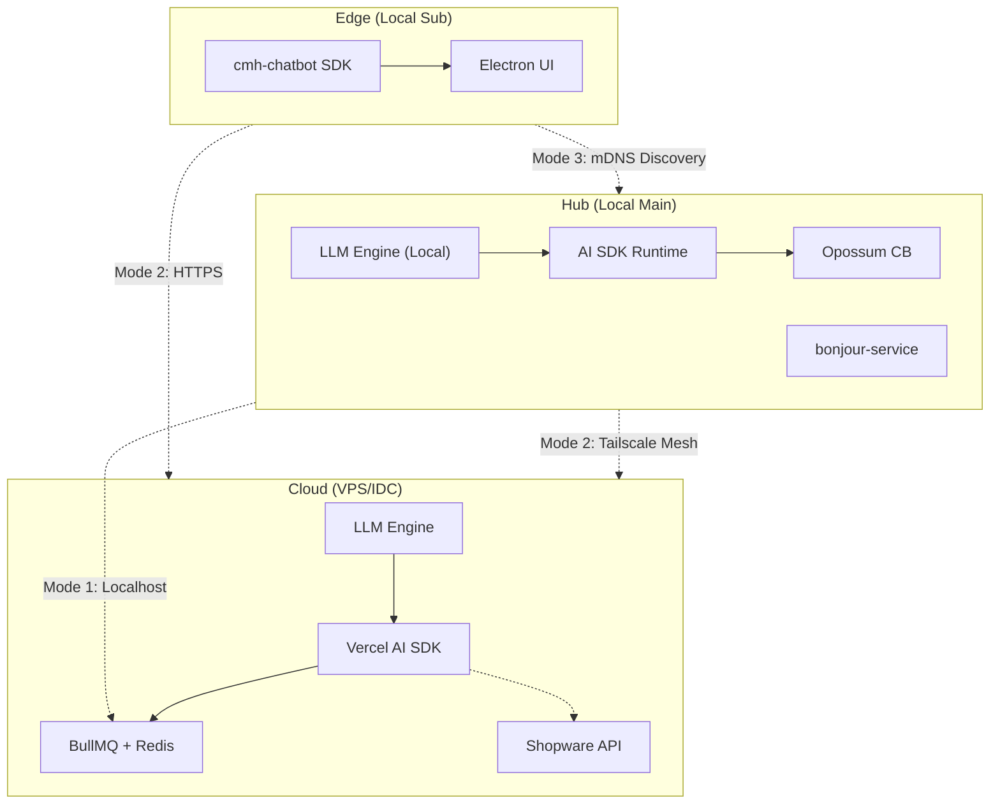
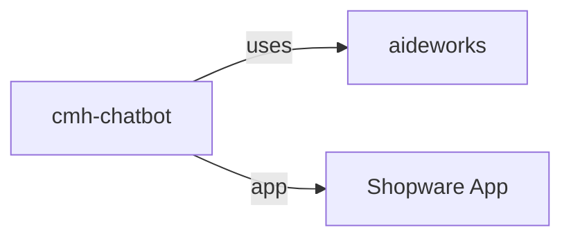
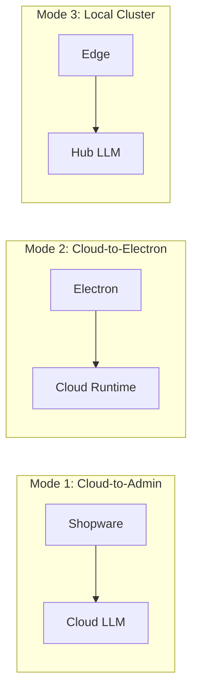
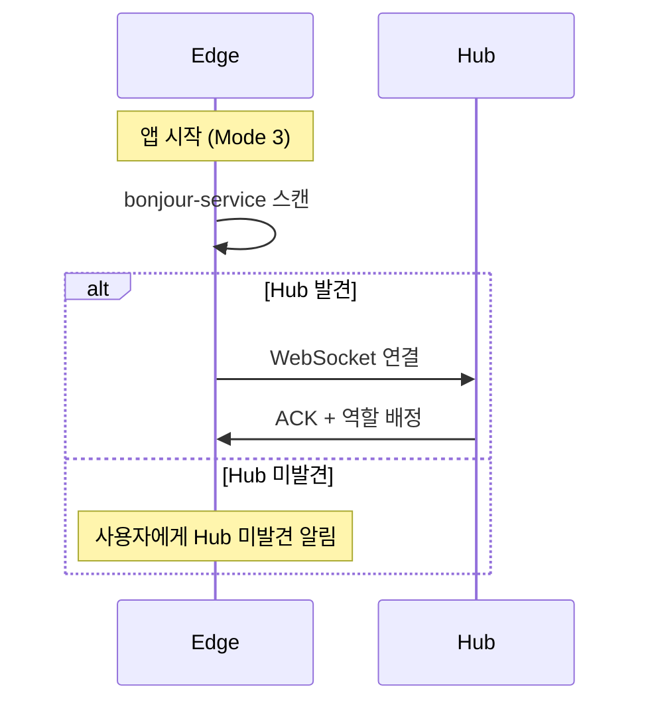
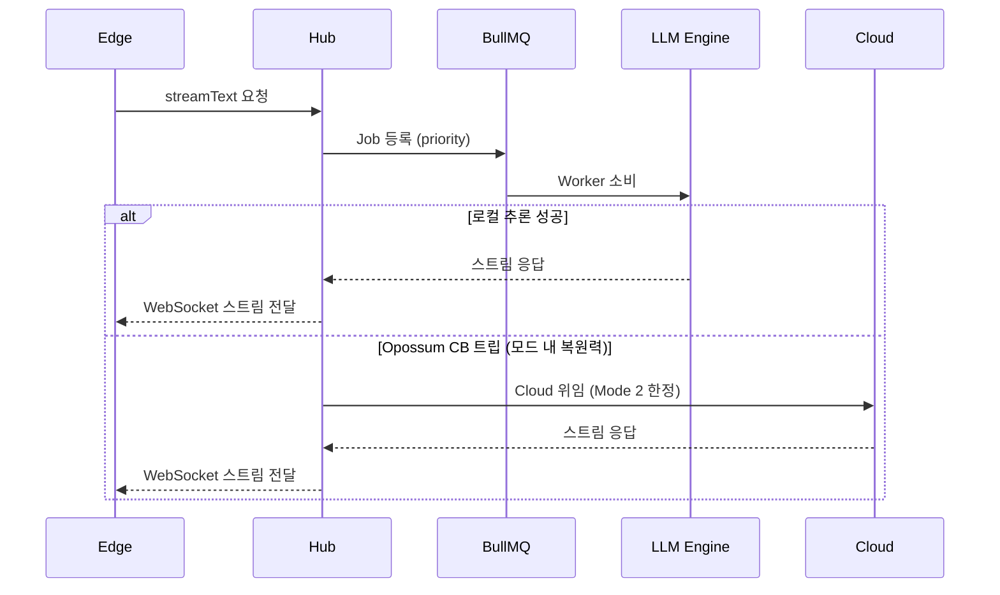
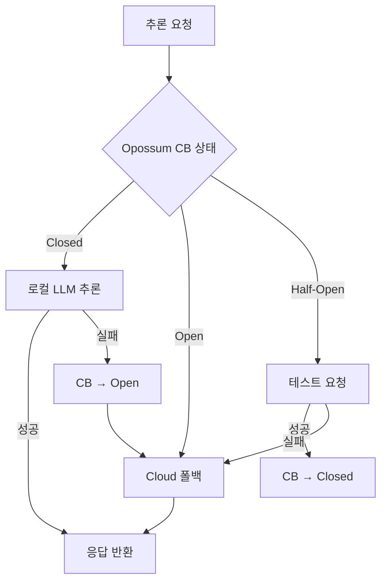
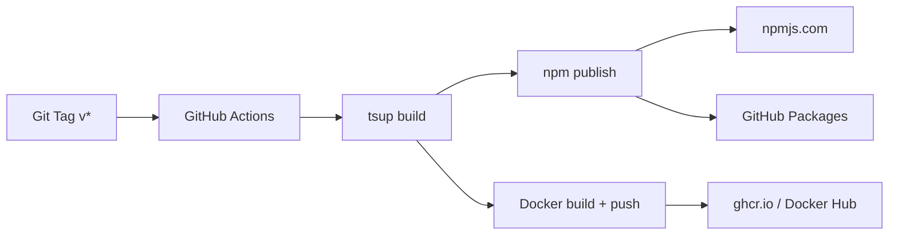

# cmhChatBot — 통합 개발 계획 (v4.0)

> **Hybrid Distributed AI Platform** — pnpm 라이브러리 + Docker 이미지 + 자체 Renderer UI 배포


### MinerU vs Docling Model 비교 도입 ###
- 정확도, 속도 비교

Rag 매니져 + huggingface MinerU or Docling 비교. 
- trigger: cronJob + Directory Watcher + 사용자 직접 . 

agent type entity <-OneToMany-> agent entity
agent type: 오케스트레이터, 매니저, 워커, 프로파일러,  서포터
매니저: 매니저는 워커 또는 다시 관리 매니저를 하위에 둘 수 있다. 
워커: 최종 업무 담당자로 나눌 수 없는 업무를 최대 3개를 맡아서 수행 할 수 있다. 
프로파일러: 채팅 후 langchain 저장 기능 hook 해서 분석해서 사용자 취향부터 심리상태까지 분석해서 파일로 저장. 
서포터: 인터넷 검색, Rag 등등. 

- ORM으로 핵심 리소스 관리
  (Agent / Tool / MCP / LLM)
- 사용자가 UI에서 선택
- workflow는 JSON으로 저장
- 실행은 동적 (retry, fail, human, loop)
- LangGraph 같은 state 기반 실행 필요
Vercel AI SDK + Vue Flow + LangChain + LangGraph

shopware meteor ui component + 자체 components 로 
채팅창와 WorkFlow 를 구현해야해. 
1차로 채팅창을 첨부한 이미지처럼 구현해줘. 
LLM Provider <-OneToMany-> Models 인데 Model Select 의 Options 에 아이템은 provider 이고 Children 으로 models 가 랜더링되게 해줘. 
개발단계에서는 mocks 데이터 사용하는데, Default 모델은 HugginFace 의 gemma4:e4b 양자화 모델이야. 근데 지난 번에 gemma4:e4b 를 다운로드 했는데... 왜 프로젝트 폴더에 안 보이지?
LangGraph Multi agent , supervisor, nodes in the node. 


---

## 요약

| 항목 | 내용 |
|------|------|
| **목표** | 온·오프라인(Cloud/Local)을 아우르는 하이브리드 분산 AI 플랫폼 |
| **AI 런타임** | **LangChain/LangGraph** + Vercel AI SDK DSP v1 + **llama.cpp server binary** (OpenAI-compatible HTTP API) |
| **AI 오케스트레이션** | **LangGraph StateGraph** (Supervisor → Manager → Worker) + **LangChain Callbacks** (Profiler Hook, 모니터링) |
| **워크플로우** | **Vue Flow** + LangGraph — 노드 컴포넌트 드래그&드롭 에디터, 실시간 실행 시각화 |
| **네트워크** | Tailscale (WAN mesh) + bonjour-service (LAN mDNS) |
| **분산 큐** | BullMQ (Redis) — 작업 분배, 우선순위, 재시도 |
| **복원력** | Opossum (Circuit Breaker) + 모드 내 자동 폴백 |
| **아키텍처** | cmh-chatbot = **Engine (라이브러리)** + **Renderer (자체 UI)**, Electron·Docker = **호스트 앱** |
| **Renderer** | Vue 3 + Shopware Meteor Components + Pinia + vue-i18n + Vue Flow (워크플로우) |
| **배포** | pnpm 패키지 (`@krommergmbh/cmh-chatbot`) + Docker Hub |

---

## 목차

1. [Architecture](#1-architecture)
2. [Tech Stack](#2-tech-stack)
3. [Modes](#3-modes)
4. [Sequence](#4-sequence)
5. [Distribution](#5-distribution)
6. [Guardrails](#6-guardrails)
7. [Next Steps](#7-next-steps)
8. [호스트 앱 구현 명세](#8-호스트-앱-구현-명세)
9. [기술 검토 보고서](#9-기술-검토-보고서-2026-04-08)
10. [LLM Provider / Model Entity 설계](#10-llm-provider--model-entity-설계)
11. [채팅 UI 아키텍처](#11-채팅-ui-아키텍처--shopware-meteor-컴포넌트-매핑)
12. [Dark / Light Mode 구현 계획](#12-dark--light-mode-구현-계획)
13. [Renderer Architecture (v4.0)](#13-renderer-architecture-v40)
14. [LangChain / LangGraph 전면 도입](#14-langchain--langgraph-전면-도입)
15. [Vue Flow 워크플로우 에디터](#15-vue-flow-워크플로우-에디터)
16. [LangGraph 모니터링 시스템](#16-langgraph-모니터링-시스템)
17. [통합 로드맵 v5.0](#17-통합-로드맵-v50)

---

## 1. Architecture

### 1.1 노드 레이어

| 노드 | 설치 환경 | 역할 | 통신 |
|------|----------|------|------|
| **Cloud** | 웹 서버 (IDC/VPS) | 모델 호스팅, 24/7 자동화, Shopware API | HTTPS, gRPC |
| **Hub** | 로컬 메인 PC | 분산 조정자, mDNS 광고, 워커 관리 | mDNS, RPC, WebSocket |
| **Edge** | 로컬 서브 기기 | 경량 클라이언트, 추론 요청 | mDNS 탐색, REST/WS |

### 1.2 전체 아키텍처 다이어그램

> **모드는 사용자가 선택**한다. 아래 다이어그램은 전체 노드 토폴로지이며, 실제 운영에서는 Mode 1/2/3 중 하나만 활성화된다.



### 1.3 라이브러리 관계



### 1.4 역할 분리 — 라이브러리 vs 호스트 앱

> **핵심 원칙**: cmh-chatbot은 **엔진(라이브러리)**이다. 포트 바인딩, UI, 도메인/SSL, Tailscale 설정 등은 **호스트 앱**이 담당한다.

```
┌──────────────────────────────────────────────────────────┐
│                   cmh-chatbot (Library/Engine)            │
│                   @krommergmbh/cmh-chatbot                │
│                                                          │
│  ┌────────────┐ ┌──────────┐ ┌───────────┐ ┌─────────┐  │
│  │ AI SDK     │ │ BullMQ   │ │ Opossum   │ │ Hono    │  │
│  │ Wrapper    │ │ Queue    │ │ CB        │ │ Routes  │  │
│  └────────────┘ └──────────┘ └───────────┘ └─────────┘  │
│                                                          │
│  Exports: createChatServer(), createChatBot(), CLI       │
└──────────────────────┬───────────────────────────────────┘
                       │  npm install / import
          ┌────────────┼────────────────┐
          ▼            ▼                ▼
  ┌──────────────┐ ┌───────────┐ ┌──────────────────────────┐
  │ Electron App │ │ Docker    │ │ Shopware App              │
  │ (Host)       │ │ (Host)    │ │ (meteor-admin-sdk)         │
  │              │ │           │ │                            │
  │ • UI 렌더링  │ │ • 포트/SSL│ │ • 독립 DB·Entity·UI       │
  │ • Tailscale  │ │ • 도메인  │ │ • @shopware-ag/            │
  │ • PWA 서빙   │ │ • Docker  │ │   meteor-admin-sdk         │
  │ • 로컬 모델  │ │   Compose │ │ • Admin에 App으로 등록     │
  └──────────────┘ └───────────┘ └──────────────────────────┘
```

#### 책임 분리표

| 책임 | cmh-chatbot (라이브러리) | Electron / Docker (호스트) |
|------|:---:|:---:|
| AI 추론 파이프라인 | ✅ | |
| LLM 프로바이더 설정 | ✅ | |
| BullMQ 큐 로직 | ✅ | |
| Circuit Breaker | ✅ | |
| Hono 라우트 정의 | ✅ | |
| mDNS 광고/탐색 | ✅ | |
| **포트 바인딩** | | ✅ |
| **SSL/도메인 설정** | | ✅ |
| **Tailscale 설치/관리** | | ✅ |
| **UI 렌더링** | | ✅ |
| **PWA 정적 파일 서빙** | | ✅ |
| **Docker Compose 설정** | | ✅ |
| **방화벽/UAC 자동화** | | ✅ |

#### Shopware App 등록 방식

cmh-chatbot은 Shopware Admin에 **Plugin이 아닌 App**으로 등록한다.

| 특성 | 설명 |
|------|------|
| **독립 DB** | cmh-chatbot 자체 Entity, Definition, Repository — Shopware DB와 분리 |
| **독립 UI** | Renderer를 자체 빌드하여 Shopware Admin 내 App iframe 또는 module로 탑재 |
| **독립 라이브러리** | LangChain, LangGraph, Vercel AI SDK 등 AI 스택을 자체 번들 |
| **통합 SDK** | `@shopware-ag/meteor-admin-sdk`로 Shopware Admin과 통신 (위치·알림·데이터 동기화) |
| **AideWorks 통합** | AideWorks Electron 앱에서는 라이브러리(`@krommergmbh/cmh-chatbot`)로 직접 import |

**Shopware App 아키텍처:**

```
┌─────────────────────────────────────────────────────┐
│                 Shopware Admin                       │
│  ┌───────────────────────────────────────────────┐   │
│  │   cmh-chatbot (Shopware App)                  │   │
│  │                                               │   │
│  │   ┌──────────┐ ┌─────────┐ ┌──────────────┐  │   │
│  │   │ 자체 DB  │ │ 자체 UI │ │ AI Libraries │  │   │
│  │   │ Entity   │ │ Vue 3   │ │ LangChain    │  │   │
│  │   │ Definit. │ │ Meteor  │ │ LangGraph    │  │   │
│  │   └──────────┘ └─────────┘ └──────────────┘  │   │
│  │                    ▲                          │   │
│  │                    │ meteor-admin-sdk          │   │
│  └────────────────────┼──────────────────────────┘   │
│                       │                              │
│            Shopware Admin Host                       │
└─────────────────────────────────────────────────────┘
```

```typescript
// Shopware Admin — cmh-chatbot App 등록
import { location, notification, data } from '@shopware-ag/meteor-admin-sdk';

// App이 Shopware Admin 내에서 위치 확보
location.startAutoResizer();

// Shopware 데이터와 동기화 (필요 시)
const orders = await data.get({ id: 'order', criteria: { limit: 10 } });

// AI 채팅 실행
import { ChatClient } from '@krommergmbh/cmh-chatbot/client';
const chat = new ChatClient({
  endpoint: 'wss://chat.example.com/ws/chat',
});
await chat.send({ text: '이번 달 매출 분석해줘', context: orders });
```

```yaml
# docker-compose.yml — Shopware + cmh-chatbot App 동시 운영
services:
  shopware:
    image: shopware/production:latest
    ports: ["8000:8000"]
  chatbot:
    image: krommergmbh/cmh-chatbot:latest
    ports: ["4000:4000"]
    environment:
      - REDIS_HOST=redis
      - SHOPWARE_APP_MODE=true
  redis:
    image: redis:7-alpine
```

#### 호스트 앱 통합 예시

```typescript
// Electron 앱에서 cmh-chatbot 라이브러리 사용
import { createChatServer } from '@krommergmbh/cmh-chatbot/server';

const server = createChatServer({
  mode: 'hub',
  llm: { provider: 'ollama', model: 'llama3.2' },
  redis: { host: 'localhost', port: 6379 },
  discovery: { mdns: true, tailscale: false },
});

// 호스트가 포트 바인딩 담당
server.listen({ port: 4000, hostname: '0.0.0.0' });
```

```typescript
// Docker 환경에서 cmh-chatbot 라이브러리 사용
import { createChatServer } from '@krommergmbh/cmh-chatbot/server';

const server = createChatServer({
  mode: 'cloud',
  llm: { provider: 'ollama', baseURL: 'http://ollama:11434' },
  redis: { host: 'redis', port: 6379 },
  discovery: { mdns: false, tailscale: false },
});

// Docker EXPOSE로 호스트 포트 매핑
server.listen({ port: 4000 });
```

---

## 2. Tech Stack

### 2.1 핵심 의존성

| 영역 | 라이브러리 | 버전 | 선정 이유 |
|------|-----------|------|----------|
| **AI Runtime** | **llama.cpp server binary** (b8712) + Vercel AI SDK DSP v1 | latest | OpenAI-compatible HTTP API, CPU별 DLL 자동선택, 인프로세스 불필요 |
| **AI Orchestration** | `ai` (Vercel AI SDK) + `@ai-sdk/vue` | ^6.0 | 프레임워크 무관, 스트리밍, 멀티 프로바이더, TS 네이티브 |
| **AI Agent** | `langchain` + `@langchain/core` + `@langchain/langgraph` | ^1.3 | Multi-Agent Supervisor, State-based workflow, LangGraph nodes |
| **Job Queue** | `bullmq` + `ioredis` | ^5.0 | 분산 작업 큐, 우선순위, 재시도, 지연 실행 |
| **mDNS** | `bonjour-service` | ^1.2 | TS 타입, LAN 자동 발견, zero-conf |
| **WAN Mesh** | Tailscale CLI | — | WireGuard 기반, MagicDNS, ACL |
| **Circuit Breaker** | `opossum` | ^8.0 | Node.js 표준, 반개방(half-open) 상태, 폴백 함수 |
| **HTTP Server** | `hono` | ^4.0 | 초경량(12KB), Edge/Node/Bun 호환, 미들웨어 풍부 |
| **WebSocket** | `ws` | ^8.0 | 스트리밍 추론 응답 전달 |
| **CLI** | `commander` | ^12.0 | 서브커맨드, 자동 헬프, TS 지원 |
| **Build (Engine)** | `tsup` | ^8.0 | esbuild 기반, CJS/ESM 듀얼 빌드 + DTS |
| **Build (Renderer)** | `vite` + `@vitejs/plugin-vue` | ^6.4 | Vue 3 SFC 지원, HMR, 번들 최적화 |
| **Monitoring** | `prom-client` | ^15.0 | Prometheus 메트릭 수집 |

### 2.1.1 Renderer 의존성 (v4.0 신규)

| 영역 | 라이브러리 | 버전 | 선정 이유 |
|------|-----------|------|----------|
| **UI Framework** | `vue` | ^3.5 | AideWorks 패턴 통일, Composition + Options API |
| **Component Library** | `@shopware-ag/meteor-component-library` | ^4.28 | Shopware Meteor 디자인 시스템, mt-* 컴포넌트 |
| **Router** | `vue-router` | ^4.6 | Hash history, 모듈 기반 동적 라우팅 |
| **State** | `pinia` | ^3.0 | Vue 3 공식 상태 관리, Composition API |
| **i18n** | `vue-i18n` | ^9.14 | 5개 locale (ko-KR, en-GB, de-DE, zh-CN, ja-JP) |
| **Workflow** | `@vue-flow/core` + `background` + `controls` | ^1.48 | 노드 기반 워크플로우 에디터 |
| **Icons** | `iconify-icon` + `@iconify/vue` | ^3.0 | Meteor Icon Kit 외 보조 아이콘 |
| **CSS** | `sass` | ^1.99 | SCSS 변수, 테마 토큰 |

### 2.2 CopilotKit → Vercel AI SDK 전환 근거

| 비교 항목 | CopilotKit | Vercel AI SDK |
|----------|-----------|---------------|
| React 의존성 | **필수** (Runtime이 React에 결합) | **없음** (Node.js headless 가능) |
| 프로바이더 | OpenAI 어댑터 중심 | ollama, llama.cpp, OpenAI, Anthropic 등 50+ |
| 스트리밍 | 자체 프로토콜 | Web Streams API 표준 |
| 라이브러리 배포 | 어려움 (UI 프레임워크 포함) | **최적** (코어만 분리 가능) |
| Docker headless | 불편 | **완벽 지원** |
| Benchmark | 78.87 | **90.66** |

**결론:** cmh-chatbot은 **라이브러리 + Docker 배포**가 목표이므로 React 의존성 없는 Vercel AI SDK가 최적. 라이브러리는 Hono 라우트만 정의하고, 포트 바인딩·SSL은 호스트 앱이 담당.

### 2.3 BullMQ 도입 근거

기존 계획의 "Ping 기반 가중치 분배"를 BullMQ로 대체:

```
기존: Hub → Ping 측정 → 수동 가중치 → 직접 RPC 호출
개선: Hub → BullMQ Queue 등록 → Worker 자동 소비 → 우선순위/재시도/지연 내장
```

| 기능 | 수동 구현 | BullMQ |
|------|---------|--------|
| 작업 큐 | 직접 구현 필요 | 내장 |
| 우선순위 | 직접 구현 | priority 옵션 |
| 재시도/백오프 | 직접 구현 | attempts + backoff |
| 지연 실행 | 직접 구현 | delay 옵션 |
| Worker 병렬성 | 직접 구현 | concurrency 옵션 |
| 모니터링 UI | 없음 | Bull Board / QueueDash |

---

## 3. Modes

> **사용자가 설치 시 모드를 선택**한다. 자동 폴백이 아니라 운영 환경에 맞는 모드 하나를 골라 운영하는 구조.
> 각 모드 **내부**에서는 Opossum Circuit Breaker가 일시적 장애에 대응한다.

### 3.1 웹 서버 설치형 (Cloud-to-Admin)

| 항목 | 내용 |
|------|------|
| **구조** | 웹 서버(Ollama + AI SDK + Hono) ↔ Shopware Admin API |
| **컨셉** | "Native AI Integration" |
| **설명** | 동일 하드웨어에서 AI 엔진과 쇼핑몰 관리 도구가 직접 통신. 외부 인터넷 무관하게 상품/주문 데이터를 AI가 즉시 처리하는 백본 역할 |
| **장점** | 지연 최소, 24/7 자동화(상품설명 생성, 주문분석) |
| **기술 흐름** | Shopware Webhook → Hono API → BullMQ Job → LLM Inference → Shopware API 응답 |

### 3.2 하이브리드 호스팅형 (Cloud-to-Electron)

| 항목 | 내용 |
|------|------|
| **구조** | 웹 서버(Hosted Runtime) ↔ 로컬 Electron 앱 (cmh-chatbot SDK) |
| **컨셉** | "Anywhere Access" |
| **설명** | 로컬에 AI 모델 미설치, 웹 서버의 Remote Runtime을 호출. 로컬은 UI, 캐시, 전처리만 담당 |
| **장점** | 저사양 기기에서도 고성능 AI 사용 가능 |
| **기술 흐름** | Electron → cmh-chatbot SDK → HTTPS/WS → Hono → AI SDK streamText → LLM Engine |
| **모드 내 복원력** | Opossum CB 감시 → Cloud LLM 응답 실패 시 재시도/서킷 오픈 알림 |

### 3.3 로컬 클러스터형 (Local Hub-to-Sub)

| 항목 | 내용 |
|------|------|
| **구조** | 로컬 메인 앱(Hub) ↔ 로컬 서브 앱(Edge) |
| **컨셉** | "Private AI Grid" |
| **설명** | LAN 내 고사양 PC가 Hub, 나머지가 Edge. mDNS 자동 발견, 외부 망 불필요 |
| **장점** | 보안 완벽, 초저지연, 데이터 주권 보장 |
| **기술 흐름** | Edge → bonjour-service 스캔 → Hub 발견 → WebSocket 연결 → BullMQ Job → LLM 추론 |
| **방화벽** | Hub 실행 시 netsh 자동 설정 (5353, 4000, 8080) |

### 3.4 모드별 비교



---

## 4. Sequence

### 4.1 인프라 자동화 (Pre-Launch)

> 아래는 **호스트 앱**(Electron / Docker)이 수행하는 초기화 절차이다. cmh-chatbot 라이브러리는 `server.listen()` 이후의 런타임만 담당.

```
1. Admin 권한 요청 (UAC) — Electron 호스트만 해당
2. 방화벽 자동 설정: netsh → 5353(mDNS), 4000(Runtime), 8080(LLM)
3. Tailscale 상태 확인 → 가상 IP 획득 (Mode 2/3)
4. Redis 연결 확인 (BullMQ 큐 준비)
5. LLM 서버 헬스체크
```

### 4.2 서비스 발견 및 연결 (Discovery — Mode 3 전용)



### 4.3 추론 요청 흐름 (Inference)



### 4.4 Failover 흐름



---

## 5. Distribution

### 5.1 패키지 구조

```
cmh-chatbot/
├── src/
│   ├── core/           # AI SDK 래퍼, 프로바이더 설정
│   ├── discovery/      # mDNS (bonjour-service), Tailscale
│   ├── queue/          # BullMQ 큐 매니저
│   ├── resilience/     # Opossum circuit breaker
│   ├── server/         # Hono HTTP/WS 서버
│   ├── client/         # SDK 클라이언트 (Edge용)
│   └── cli/            # Commander CLI
├── Dockerfile
├── docker-compose.yml
├── package.json
├── tsconfig.json
├── tsup.config.ts
└── README.md
```

### 5.2 npm 패키지 배포

> **npmjs.com**에 `@krommergmbh/cmh-chatbot`으로 publish한다. GitHub 직접 설치(`github:KrommerGmbH/cmh-chatbot`)도 가능.

```jsonc
// package.json (핵심 필드)
{
  "name": "@krommergmbh/cmh-chatbot",
  "version": "0.1.0",
  "type": "module",
  "exports": {
    ".": { "import": "./dist/index.mjs", "require": "./dist/index.cjs" },
    "./client": { "import": "./dist/client.mjs" },
    "./server": { "import": "./dist/server.mjs" }
  },
  "bin": { "cmh-chatbot": "./dist/cli.mjs" }
}
```

**설치 방법 (3가지):**

```bash
# 1) npmjs.com (메인)
pnpm add @krommergmbh/cmh-chatbot

# 2) GitHub 직접 (npmjs.com publish 전에도 사용 가능)
pnpm add github:KrommerGmbH/cmh-chatbot

# 3) GitHub Packages (private 레지스트리)
pnpm add @krommergmbh/cmh-chatbot --registry=https://npm.pkg.github.com
```

```typescript
import { createChatBot } from '@krommergmbh/cmh-chatbot';

const bot = createChatBot({
  mode: 'hub',
  llm: { provider: 'ollama', model: 'llama3.2' }, // 프로바이더는 향후 선택
  redis: { host: 'localhost', port: 6379 },
});

await bot.start();
```

**호스트 서버 통합 예:**

```typescript
import { createChatServer } from '@krommergmbh/cmh-chatbot/server';

// 라이브러리가 Hono 앱을 생성 → 호스트가 listen
const server = createChatServer({
  mode: 'cloud',
  llm: { provider: 'ollama', baseURL: 'http://localhost:11434' },
  redis: { host: 'localhost', port: 6379 },
});

server.listen({ port: 4000 }); // 포트 바인딩은 호스트 책임
```

### 5.3 Docker 배포

> Docker Compose 구성은 **호스트 앱**의 책임이다. cmh-chatbot은 `server.mjs` 엔트리포인트만 제공.

```dockerfile
# Multi-stage: LLM Engine + cmh-chatbot
# Note: LLM 런타임 결정 후 베이스 이미지 확정 (Ollama / node-llama-cpp)
FROM ollama/ollama:latest AS runtime
FROM node:22-slim AS app
COPY --from=runtime /usr/bin/ollama /usr/bin/ollama
RUN corepack enable && corepack prepare pnpm@latest --activate
WORKDIR /app
COPY package.json pnpm-lock.yaml ./
RUN pnpm install --frozen-lockfile --prod
COPY dist/ ./dist/
EXPOSE 4000 8080
CMD ["node", "dist/server.mjs"]
```

**사용 예:**

```bash
docker pull krommergmbh/cmh-chatbot:latest
docker run -d -p 4000:4000 -p 8080:8080 krommergmbh/cmh-chatbot
```

### 5.4 CI/CD 파이프라인



---

## 6. Guardrails

### 6.1 개발 규칙

| 규칙 | 설명 |
|------|------|
| **Sticky Session** | 대화 세션은 동일 노드에서 완료될 때까지 고정 (BullMQ Job ID로 추적) |
| **Circuit Breaker** | Opossum: timeout 10s, errorThresholdPercentage 50, resetTimeout 30s |
| **보안** | Tailscale ACL로 접근 제한 — 외부 Nginx 리버스 프록시는 호스트 앱 담당 |
| **i18n** | 사용자 노출 텍스트는 모두 i18n 스니펫 (5개 locale: ko/en/de/zh/ja) |
| **ID** | 모든 Entity는 UUID (crypto.randomUUID) |
| **색상** | CSS Custom Property만 사용, 하드코딩 금지 |

### 6.2 운영 규칙

| 규칙 | 설명 |
|------|------|
| **Health Check** | /health 엔드포인트: LLM Engine + Redis + 디스크 상태 리포트 |
| **Metrics** | prom-client로 추론 지연, 큐 길이, CB 상태 수집 |
| **Model Sync** | 최초 실행 시만 모델 다운로드, 이후 캐시 경로 재사용 |
| **Log** | 구조화 JSON 로그 (pino), 레벨별 분리 |

---

## 7. Next Steps

### Phase 1 — Core SDK (2주)

- [x] package.json + tsup 빌드 설정 *(v0.2.0, 4 entries: index/client/server/cli, ESM+CJS+DTS)*
- [x] llama.cpp server binary 통합 *(b8712, OpenAI-compatible `/v1/chat/completions` HTTP API)*
- [x] `LlamaServer` 클래스 *(Managed/External 2가지 모드, 헬스체크 폴링)*
- [x] `InferenceEngine` — stream() + generate() *(SSE 파싱, stream_options: include_usage)*
- [x] `createChatServer()` 팩토리 API *(src/server/factory.ts)*
- [x] BullMQ 큐 매니저 *(src/queue/manager.ts, worker.ts, connection.ts)*
- [x] Opossum Circuit Breaker 래퍼 *(src/resilience/circuit-breaker.ts)*
- [x] Hono HTTP/WS 라우트 정의 *(POST /api/chat SSE→DSP 프록시, POST /api/generate, WebSocket)*
- [x] Commander CLI *(start --binary/--server-url/--model, pull 제거)*
- [x] 에이전트 프레임워크 *(orchestrator.ts, harness.ts, security-gate.ts, prompt-renderer.ts)*
- [x] RAG 파이프라인 인터페이스 *(src/rag/pipeline.ts)*
- [x] SDK 클라이언트 *(src/client/chat-client.ts)*
- [x] E2E 추론 검증 *(playground → llama-server → Gemma 3 4B → DSP v1 출력 확인)*
- [x] `createChatBot()` 편의 팩토리 *(src/chatbot.ts — LlamaServer+Inference+Queue+Discovery+Agent+RAG+ModelFactory 통합)*

### Phase 2 — Discovery and Network (1주)

- [x] bonjour-service mDNS 광고/탐색 *(src/discovery/mdns.ts — 코드 작성 완료)*
- [x] Tailscale CLI 통합 *(src/discovery/tailscale.ts — 코드 작성 완료)*
- [ ] mDNS + Tailscale 실제 통합 테스트
- [ ] 방화벽 자동 설정 스크립트 (Windows netsh)

### Phase 3 — Distribution (1주)

- [x] Docker multi-stage 빌드 *(llama.cpp server binary 소스 빌드, 3-stage Dockerfile)*
- [x] docker-compose.yml 예제 *(루트에 존재, Redis + chatbot, llama-server binary 모드)*
- [ ] GitHub Actions: npm publish + Docker push
- [ ] README.md 설치/사용법 문서

### Phase 4 — Host App Integration (2주)

- [ ] Electron 호스트 앱(AideWorks)에서 `createChatServer()` 통합
- [ ] AideWorks Chat UI 구현 *(§11 Meteor 컴포넌트 매핑 기반)*
- [ ] 모드 선택 (Hub/Edge/Cloud) 설정 UI
- [ ] 대시보드: 연결 노드, CPU/GPU, 큐 상태
- [ ] PWA Mobile 클라이언트 scaffold (manifest.json, Service Worker)

---

*v3.0 — 기술 스택 최적화, 검증된 라이브러리 매핑, 배포 전략 구체화 (2026-04-08)*

---

## 8. 호스트 앱 구현 명세

> 아래는 cmh-chatbot **라이브러리가 구현하지 않는** 영역이다.
> 호스트 앱(Electron / Docker / Shopware Plugin)이 라이브러리의 인터페이스를 주입받아 직접 구현해야 한다.

### 8.1 계층형 멀티 에이전트 시스템

#### 아키텍처

```
┌─────────────────────────────────────────────────────────────┐
│                    비서 / 오케스트레이터 (1)                  │
│                    (사용자 의도 파악 → 매니저 라우팅)          │
└────────────────────────────┬────────────────────────────────┘
                             │ dispatch
         ┌───────────────────┼───────────────────┐
         ▼                   ▼                   ▼
┌─────────────────┐ ┌─────────────────┐ ┌─────────────────┐
│ 매니저 A        │ │ 매니저 B        │ │ … (~50개 분야)  │
│ (쇼핑, 주문)    │ │ (건강, 운동)    │ │                 │
└────────┬────────┘ └────────┬────────┘ └────────┬────────┘
         │                   │                   │
    ┌────┴────┐         ┌────┴────┐         ┌────┴────┐
    ▼         ▼         ▼         ▼         ▼         ▼
┌────────┐┌────────┐┌────────┐┌────────┐┌────────┐┌────────┐
│워커 A-1││워커 A-2││워커 B-1││워커 B-2││워커 N-1││워커 N-2│
│(상품   ││(주문   ││(식단   ││(운동   ││        ││        │
│ 분석)  ││ 처리)  ││ 추천)  ││ 기록)  ││        ││        │
└────────┘└────────┘└────────┘└────────┘└────────┘└────────┘

┌─────────────────────────────────────────────────────────────┐
│                     지원 에이전트 (횡단)                      │
│  ┌──────────┐ ┌──────────┐ ┌──────────┐ ┌────────────────┐  │
│  │ 검색     │ │ 조사     │ │ 팩트체크 │ │ 심리분석       │  │
│  │ (웹/RAG) │ │ (딥리서치)│ │ (교차검증)│ │ (사용자 취향)  │  │
│  └──────────┘ └──────────┘ └──────────┘ └────────────────┘  │
└─────────────────────────────────────────────────────────────┘
```

#### cmh-chatbot ↔ 호스트 책임 분리

| 기능 | cmh-chatbot (라이브러리) | 호스트 앱 |
|------|:---:|:---:|
| `AgentOrchestrator` 실행 엔진 | ✅ | |
| `AgentHarness` 실행 프레임워크 | ✅ | |
| `SecurityGate` 규칙 엔진 (승인 판정 로직) | ✅ | |
| `PromptRenderer` (템플릿 → 실제 프롬프트 변환) | ✅ | |
| BullMQ 워커 디스패처 | ✅ | |
| **매니저/워커 에이전트 정의 (JSON/DB)** | | ✅ |
| **다이나믹 프롬프트 DB 스키마 + CRUD** | | ✅ |
| **프롬프트 편집 UI** | | ✅ |
| **사용자 승인 모달/알림 UI** | | ✅ |
| **에이전트 활성화/비활성화 관리 UI** | | ✅ |
| **사용자 취향 프로필 DB** | | ✅ |

#### 하네스 (Harness) 실행 모델

```typescript
// cmh-chatbot이 제공하는 인터페이스
interface AgentDefinition {
  id: string;                          // UUID
  role: 'orchestrator' | 'manager' | 'worker' | 'support';
  parentId: string | null;             // 계층 관계
  promptTemplateId: string;            // DB에 저장된 프롬프트 템플릿 참조
  tools: string[];                     // MCP 도구 목록
  securityLevel: 'auto' | 'notify' | 'approve'; // 보안 규칙
}

interface HarnessConfig {
  agents: AgentDefinition[];           // 호스트가 DB에서 로드하여 주입
  promptStore: PromptStore;            // 호스트가 구현체 주입
  securityGate: SecurityGate;          // 호스트가 승인 콜백 주입
}
```

#### 다이나믹 프롬프트 시스템

| 구성 요소 | 저장소 | 설명 |
|----------|--------|------|
| **프롬프트 템플릿** | DB (호스트) | 시스템 프롬프트, 페르소나, 컨텍스트 지시문 |
| **사용자 커스텀 프롬프트** | DB (호스트) | 사용자가 UI에서 추가/수정한 프롬프트 조각 |
| **변수 바인딩** | 런타임 (라이브러리) | `{{user.name}}`, `{{context.currentPage}}` 등 치환 |
| **프롬프트 버전 관리** | DB (호스트) | 변경 이력, 롤백 가능 |

```
┌─────────────────────────────────────────────────┐
│  호스트 앱 — 프롬프트 편집 UI                     │
│  ┌───────────────────────────────────────────┐   │
│  │  시스템 프롬프트   [편집]                   │   │
│  │  "당신은 사용자의 충실한 비서입니다..."      │   │
│  ├───────────────────────────────────────────┤   │
│  │  사용자 추가 규칙  [+ 추가]                │   │
│  │  • "한국어로 답변해줘"                     │   │
│  │  • "재무 관련은 반드시 확인 후 실행"        │   │
│  ├───────────────────────────────────────────┤   │
│  │  에이전트별 프롬프트  [매니저 선택 ▼]       │   │
│  │  • 쇼핑 매니저: "가격 비교 시 3곳 이상..."  │   │
│  └───────────────────────────────────────────┘   │
└─────────────────────────────────────────────────┘
         │ DB 저장
         ▼
┌─────────────────────────────────────────────────┐
│  cmh-chatbot — PromptRenderer                   │
│  템플릿 로드 → 변수 치환 → 최종 프롬프트 조립    │
│  → LLM 호출                                     │
└─────────────────────────────────────────────────┘
```

#### 보안 규칙 (사용자 승인)

| 보안 레벨 | 동작 | 예시 |
|----------|------|------|
| `auto` | 자동 실행, 사후 로그만 | 날씨 조회, 일정 확인 |
| `notify` | 자동 실행 + 사용자에게 알림 | 이메일 초안 작성, 상품 분석 |
| `approve` | 사용자 승인 후 실행 (UI 모달) | 결제, 주문, 파일 삭제, 외부 API 호출 |

```
워커 실행 요청 → SecurityGate 판정
  ├── auto    → 즉시 실행 → 로그 저장
  ├── notify  → 즉시 실행 → Push/알림 발송 (호스트 UI)
  └── approve → 대기 상태 → 호스트 UI에 승인 모달 표시
                           → 사용자 승인 → 실행
                           → 사용자 거부 → 취소 + 로그
```

---

### 8.2 RAG (Retrieval-Augmented Generation)

#### 전체 파이프라인

```
┌──────────────────────────────────────────────────────────────────┐
│  호스트 앱 (데이터 수집 + 저장)                                    │
│                                                                  │
│  ① 대화 히스토리      ② 사용자 파일 업로드     ③ 웹 검색         │
│     │                    │                       │               │
│     ▼                    ▼                       ▼               │
│  [전체 저장]         [docling /              [CommonCrawl        │
│  텍스트 + AI         llamaParse]              + DuckDB]          │
│  thinking 포함           │                       │               │
│     │                    ▼                       │               │
│     │              [MD 변환 결과]                 │               │
│     │                    │                       │               │
│     ▼                    ▼                       ▼               │
│  ┌────────────────────────────────────────────────────────┐      │
│  │              DB (SQLite / PostgreSQL)                  │      │
│  │                                                        │      │
│  │  • conversation_messages (텍스트 + thinking)           │      │
│  │  • conversation_embeddings (임베딩 벡터)               │      │
│  │  • documents (파일 메타데이터)                          │      │
│  │  • document_sections (섹션별 청크)                     │      │
│  │  • document_embeddings (섹션 임베딩 벡터)              │      │
│  │  • web_cache (CommonCrawl 검색 결과 캐시)              │      │
│  └────────────────────────────────────────────────────────┘      │
└──────────────────────────────────┬───────────────────────────────┘
                                   │ 인터페이스 주입
                                   ▼
┌──────────────────────────────────────────────────────────────────┐
│  cmh-chatbot (검색 + 컨텍스트 조립)                               │
│                                                                  │
│  RAGPipeline.retrieve(query)                                     │
│    → VectorStore.search(embedding, topK)                         │
│    → ContextAssembler.build(chunks, maxTokens)                   │
│    → PromptRenderer.inject(systemPrompt, ragContext)             │
│    → LLM 호출                                                    │
└──────────────────────────────────────────────────────────────────┘
```

#### ① 대화 히스토리 저장

| 항목 | 설명 |
|------|------|
| **저장 대상** | 모든 메시지 (user, assistant, system) + AI thinking/reasoning 전문 |
| **텍스트 저장** | 원문 그대로 DB 저장 (검색, 감사, 디버깅용) |
| **임베딩 저장** | 메시지 단위로 임베딩 벡터 생성 → DB 저장 (유사 대화 검색용) |
| **임베딩 모델** | 호스트가 결정 (로컬 LLM 임베딩 or OpenAI text-embedding-3-small) |
| **검색** | 사용자 질문 → 과거 대화 임베딩 유사도 검색 → 컨텍스트 주입 |

```typescript
// cmh-chatbot이 제공하는 인터페이스
interface ConversationStore {
  saveMessage(msg: {
    conversationId: string;
    role: 'user' | 'assistant' | 'system';
    content: string;          // 원문 텍스트
    thinking?: string;        // AI reasoning/thinking 전문
    embedding: number[];      // 임베딩 벡터
    metadata?: Record<string, unknown>;
  }): Promise<void>;

  searchSimilar(embedding: number[], topK: number): Promise<Message[]>;
}
// → 호스트가 SQLite/PostgreSQL 구현체를 주입
```

#### ② 사용자 파일 → RAG 인덱싱

**변환 파이프라인 (호스트 구현):**

```
파일 업로드 (PDF, DOCX, PPTX, HTML, …)
  │
  ▼
문서 파싱 (docling + llamaParse 무료 티어)
  │
  ▼
Markdown 변환 결과
  │
  ▼
청킹 전략 선택
  ├── 의미론적 청킹: 문단 경계 + 임베딩 유사도 기반 분할
  └── 섹션 기반 청킹: 헤딩(#, ##, ###) 단위 분할
  │
  ▼
섹션별 임베딩 벡터 생성
  │
  ▼
DB 저장
```

**DB 스키마 (호스트 구현):**

```
documents
  ├── id: UUID (PK)
  ├── fileName: string
  ├── mimeType: string
  ├── theme: string              ← 파일의 주제/테마 분류
  ├── createdAt: datetime
  └── updatedAt: datetime

document_sections              (documents 1:N document_sections)
  ├── id: UUID (PK)
  ├── documentId: UUID (FK)
  ├── sectionTitle: string       ← 섹션 제목 (헤딩)
  ├── content: text              ← 청크 원문 (Markdown)
  ├── orderIndex: integer        ← 문서 내 순서
  └── tokenCount: integer

document_embeddings            (document_sections 1:1 document_embeddings)
  ├── sectionId: UUID (FK)
  ├── embedding: vector          ← 임베딩 벡터
  └── model: string              ← 사용된 임베딩 모델명
```

**MCP 서버 연동 (호스트 구현):**

```
호스트 앱 — MCP Server (stdio/http)
  │
  ├── tool: searchDocuments(query, topK)
  │     → 임베딩 유사도 검색 → 관련 섹션 반환
  │
  ├── tool: listDocumentThemes()
  │     → 파일정보 테마 목록 반환
  │
  ├── tool: getDocumentSections(documentId)
  │     → 특정 문서의 섹션 제목 목록 반환
  │
  └── resource: document://{id}/section/{sectionId}
        → 특정 섹션 원문 반환
```

#### ③ CommonCrawl + DuckDB 웹 검색

| 구성 요소 | 역할 | 구현 위치 |
|----------|------|:---:|
| **CommonCrawl 인덱스** | 공개 웹 페이지 메타데이터 (URL, 타임스탬프, MIME) | 외부 데이터 |
| **DuckDB** | CommonCrawl 인덱스를 로컬에서 SQL 쿼리 (Parquet 직접 읽기) | 호스트 |
| **웹 페이지 Fetch** | 검색된 URL에서 실제 콘텐츠 다운로드 + 정제 | 호스트 |
| **캐시** | 검색 결과를 DB에 캐싱하여 중복 Fetch 방지 | 호스트 |
| **검색 에이전트** | 라이브러리의 지원 에이전트가 호스트의 검색 도구를 호출 | cmh-chatbot |

```
사용자 질문 → 검색 에이전트 (cmh-chatbot)
  │
  ▼ MCP tool 호출
호스트 MCP Server
  │
  ├── DuckDB: CommonCrawl 인덱스에서 관련 URL 검색
  ├── Fetch: URL 콘텐츠 다운로드 + HTML→텍스트 정제
  ├── 캐시: web_cache 테이블에 저장
  └── 반환: 정제된 텍스트 + 출처 URL
  │
  ▼
cmh-chatbot RAGPipeline
  → 컨텍스트 조립 → LLM 호출
```

#### cmh-chatbot이 제공하는 RAG 인터페이스

```typescript
// 호스트가 구현하여 라이브러리에 주입하는 인터페이스들

interface VectorStore {
  upsert(id: string, embedding: number[], metadata: Record<string, unknown>): Promise<void>;
  search(query: number[], topK: number, filter?: Record<string, unknown>): Promise<SearchResult[]>;
  delete(id: string): Promise<void>;
}

interface DocumentProcessor {
  parse(file: Buffer, mimeType: string): Promise<ParsedDocument>;
  chunk(doc: ParsedDocument, strategy: 'semantic' | 'section'): Promise<DocumentChunk[]>;
}

interface WebSearchProvider {
  search(query: string, maxResults: number): Promise<WebSearchResult[]>;
}

// cmh-chatbot이 제공하는 파이프라인
interface RAGPipeline {
  retrieve(query: string, options: {
    sources: ('conversation' | 'document' | 'web')[];
    topK: number;
    maxTokens: number;
  }): Promise<RAGContext>;
}
```

---

### 8.3 호스트별 구현 범위 요약

| 구현 항목 | Electron App | Docker (Cloud) | Shopware Plugin |
|----------|:---:|:---:|:---:|
| 에이전트 정의 DB | ✅ SQLite | ✅ PostgreSQL | ✅ MySQL (Shopware DB) |
| 에이전트 관리 UI | ✅ Vue 3 | ✅ Web Admin | ❌ Shopware Admin 위임 |
| 프롬프트 편집 UI | ✅ | ✅ | ⚠️ 간이 설정만 |
| 사용자 승인 UI | ✅ 모달 + Push | ✅ Web + Push | ⚠️ Shopware Admin 알림 |
| 대화 히스토리 DB | ✅ SQLite | ✅ PostgreSQL | ⚠️ API로 조회만 |
| 파일 업로드 + 파싱 | ✅ docling + llamaParse | ✅ 동일 | ❌ |
| VectorStore 구현체 | ✅ SQLite-vss / lance | ✅ pgvector | ❌ |
| CommonCrawl + DuckDB | ✅ 로컬 DuckDB | ✅ 서버 DuckDB | ❌ |
| MCP 서버 호스팅 | ✅ stdio | ✅ http/sse | ❌ |
| 사용자 취향 프로필 DB | ✅ SQLite | ✅ PostgreSQL | ⚠️ API 연동 |

---

## 9. 기술 검토 보고서 (2026-04-08)

### 9.1 CopilotKit vs Vercel AI SDK 비교

| 항목 | **CopilotKit** | **Vercel AI SDK** |
|------|:---:|:---:|
| **Vue 지원** | ❌ React 전용 | ✅ `@ai-sdk/vue` 공식 |
| **Electron 지원** | ❌ Next.js/React 의존 | ✅ 프레임워크 무관 (headless) |
| **MCP 클라이언트** | ✅ MCP Apps (iframe 샌드박스) | ✅ `@ai-sdk/mcp` (stdio/http/sse) |
| **Generative UI** | ✅ React 컴포넌트 전용 | ✅ `message.parts` → 아무 프레임워크 |
| **Thinking/Reasoning** | ❌ 미지원 | ✅ `reasoning` 파라미터 (Anthropic, DeepSeek, Mistral 등) |
| **Streaming** | ✅ | ✅ `streamText`, `streamUI` |
| **Tool Calling** | ✅ | ✅ `toolInvocations` + `message.parts` |
| **Self-hosted** | 가능 (Node.js + React Runtime 필수) | ✅ 순수 백엔드, 프론트 분리 |
| **화면 컨텍스트 공유** | ✅ `useCopilotReadable` (내장) | ⚠️ 내장 없음 → `body`/`system` 메시지로 구현 |

**결론: Vercel AI SDK 전환 확정** — Vue 3 + Electron 환경에서 CopilotKit은 React 런타임 오버헤드가 과도함.

### 9.2 화면 컨텍스트 공유 (useCopilotReadable 대체)

#### CopilotKit 방식
```typescript
// React 전용 — Vue에서 사용 불가
useCopilotReadable({
  description: "현재 주문 목록",
  value: orders,
});
```

#### Vercel AI SDK 대체 방식 (Vue 3)

AI SDK에는 `useCopilotReadable` 같은 전용 훅이 **없지만**, 동일한 기능을 3가지 방법으로 구현할 수 있다:

**방법 1: sendMessage body에 현재 화면 상태 주입 (권장)**
```typescript
// Vue 3 — 메시지 전송 시 현재 화면 컨텍스트를 함께 전송
chat.sendMessage(
  { text: input.value },
  {
    body: {
      screenContext: {
        currentPage: route.name,
        visibleData: currentPageData.value,
        selectedItems: selectedRows.value,
      },
    },
  },
);
```

**방법 2: Transport 레벨에서 자동 주입**
```typescript
const chat = new Chat({
  transport: new DefaultChatTransport({
    api: '/api/chat',
    body: () => ({
      screenContext: collectScreenContext(), // 매 요청마다 자동 수집
    }),
  }),
});
```

**방법 3: 서버 측 system 메시지에 동적 컨텍스트 병합**
```typescript
// 서버: 요청 body의 screenContext를 system 메시지에 주입
const result = streamText({
  model: provider('llama3'),
  system: `You are a helpful assistant.
    Current screen: ${screenContext.currentPage}
    Visible data: ${JSON.stringify(screenContext.visibleData)}`,
  messages,
});
```

### 9.3 iframe Split View 화면 공유

> **질문**: Split view로 한쪽에 iframe 렌더링 시, AI가 해당 화면도 인식할 수 있는가?

| 조건 | iframe 내용 읽기 | 방법 |
|------|:---:|------|
| **Same-origin** (우리 앱 내부) | ✅ 가능 | `iframe.contentDocument` 직접 접근 |
| **Same-origin + postMessage** | ✅ 가능 | iframe ↔ 부모 양방향 통신 |
| **Cross-origin** (외부 사이트) | ❌ 불가 | 브라우저 보안 정책(CORS) 차단 |
| **Shopware Admin (same-origin 프록시)** | ✅ 가능 | 프록시로 same-origin화 + postMessage |

**구현 설계:**

```
┌─────────────────────────────────────────────┐
│  AideWorks Electron Window (Split View)     │
│                                             │
│  ┌──────────────┐  ┌────────────────────┐   │
│  │  Chat Panel  │  │  iframe Panel      │   │
│  │              │  │  (Shopware Admin)  │   │
│  │  AI ← body   │  │                    │   │
│  │  {screen     │◄─┤  postMessage()     │   │
│  │   Context}   │  │  → 현재 화면 상태  │   │
│  └──────────────┘  └────────────────────┘   │
└─────────────────────────────────────────────┘
```

**핵심**: iframe이 `postMessage`로 현재 상태(페이지명, 선택된 데이터, 폼 값 등)를 부모에게 전송 → 부모가 `sendMessage`의 `body.screenContext`에 포함 → AI가 인식.

**Shopware Admin 모듈의 경우:**
- Electron 앱 내에서 같은 origin으로 프록시 → `contentDocument` 직접 접근 가능
- 또는 Shopware Admin에 작은 브릿지 스크립트 주입 → `postMessage`로 현재 모듈/엔티티 상태 전송
- MCP 서버가 Shopware API를 직접 호출하여 데이터를 가져오는 방식도 병행 가능

### 9.4 Ollama vs node-llama-cpp 비교

| 항목 | **Ollama** | **node-llama-cpp** |
|------|:---:|:---:|
| **본체** | Go 바이너리 (서버 프로세스) | llama.cpp C++ → Node.js 바인딩 |
| **Docker 이미지** | ~2.8 GB (CUDA 포함) | ❌ Docker 이미지 없음 (npm 패키지) |
| **메모리 오버헤드** | 서버 상주 ~300-500MB 추가 | 인프로세스 → 오버헤드 없음 |
| **GPU 지원** | CUDA, Metal, ROCm | CUDA, Metal, Vulkan (자동 감지) |
| **Function Calling** | OpenAI-compatible API | `defineChatSessionFunction` 네이티브 |
| **모델 관리** | ✅ `ollama pull/list` 내장 | ❌ 수동 GGUF 파일 관리 |
| **API 호환성** | OpenAI REST API 호환 | Node.js 전용 |
| **설치** | `brew install` / Docker | `npm install node-llama-cpp` |
| **통합 방식** | HTTP API (프로세스 분리) | 인프로세스 (같은 Node.js) |
| **npm 라이브러리 배포** | ⚠️ 별도 설치 필요 | ✅ npm 의존성으로 포함 |

**참고**: 모델 파일 크기(7B ≈ 4GB)는 양쪽 동일 — Ollama가 무거운 것은 Go 서버 상주 프로세스 때문.

### 9.5 채팅 UI 렌더링 매핑 (AI SDK message.parts)

| 콘텐츠 유형 | AI SDK part type | Vue 렌더링 방식 |
|---|---|---|
| **Thinking** | `reasoning` | 접기/펼치기 UI |
| **Text** | `text` | Markdown 렌더러 |
| **Image** | `file` (image/*) | `` 컴포넌트 |
| **Video** | `file` (video/*) | `<video>` 컴포넌트 |
| **Table/DataGrid** | `tool-renderTable` | `<mt-data-table>` 또는 커스텀 그리드 |
| **iframe** | `tool-renderIframe` | `<iframe sandbox>` |
| **Shopware Module** | `tool-shopwareAdmin` | MCP 서버 → 동적 컴포넌트 로더 |
| **Sources** | `source-url`, `source-document` | 링크/문서 카드 |
| **Image Generation** | `file` (generated) | `` + 다운로드 버튼 |

### 9.6 최종 결정 사항

| 결정 | 선택 | 근거 |
|------|------|------|
| AI SDK 프론트엔드 | **`@ai-sdk/vue` useChat()** | Vue 3 공식 지원, Thinking 지원 |
| 스트리밍 프로토콜 | **Vercel AI SDK Data Stream Protocol v1** | `0:`(text), `d:`(finish), `3:`(error), `e:`(reasoning) — useChat() 호환 |
| LLM Runtime | **llama.cpp server binary 확정** | OpenAI-compatible HTTP API, CPU별 DLL 자동선택 (ivybridge/haswell/skylakex 등), 별도 프로세스로 안정적, node-llama-cpp DLL 초기화 실패 문제 회피 |
| 모델 포맷 | **GGUF** (HuggingFace Hub) | 수동 다운로드 후 `--model` 경로 지정 (llama-server.exe가 로드) |
| HTTP 서버 | **Hono + @hono/node-server** | 경량, 미들웨어 체인, SSE/WS 지원 |
| 화면 공유 | **body + postMessage 패턴** | useCopilotReadable 대체, iframe 지원 가능 |

### 9.7 Electron/Docker ↔ PWA Mobile 연결 기술검토

#### 시나리오

```
┌─────────────────────────────────────────────────────────────┐
│                  사용자의 네트워크 환경                        │
│                                                             │
│  ┌─────────────────────┐         ┌────────────────────┐     │
│  │ Electron App (Hub)  │   or    │ Docker (Cloud/VPS) │     │
│  │ 로컬 PC / NAS       │         │ 24/7 서버          │     │
│  │ Hono HTTP/WS Server │         │ Hono HTTP/WS Server│     │
│  └────────┬────────────┘         └─────────┬──────────┘     │
│           │                                │                │
│           │  WebSocket / SSE / Push API     │                │
│           │                                │                │
│           ▼                                ▼                │
│  ┌─────────────────────────────────────────────────────┐    │
│  │              PWA Mobile (스마트폰/태블릿)             │    │
│  │              Service Worker + Cache API              │    │
│  └─────────────────────────────────────────────────────┘    │
└─────────────────────────────────────────────────────────────┘
```

#### 통신 방식 비교

| 방식 | 실시간 | 오프라인 | 배터리 | 양방향 | 복잡도 |
|------|:---:|:---:|:---:|:---:|:---:|
| **WebSocket** | ✅ 즉시 | ❌ 연결 필수 | ⚠️ 상시 연결 | ✅ | 중 |
| **SSE (Server-Sent Events)** | ✅ 즉시 | ❌ 연결 필수 | 🟢 단방향이라 가벼움 | ❌ 서버→클라이언트만 | 낮음 |
| **Web Push API (VAPID)** | ✅ 즉시 | ✅ 브라우저 꺼져도 | 🟢 OS 레벨 | ❌ 서버→클라이언트만 | 높음 |
| **Polling (fetch)** | ⚠️ 간격 의존 | ❌ | ⚠️ 빈번하면 소모 | ✅ | 낮음 |

#### 권장 조합: **WebSocket + Web Push API 하이브리드**

| 상황 | 사용 기술 | 이유 |
|------|----------|------|
| **앱 열려있을 때** (채팅, 실시간 데이터) | WebSocket | 양방향, 실시간 스트리밍, AI 응답 토큰 스트림 |
| **앱 닫혀있을 때** (알림, 작업 완료) | Web Push API | Service Worker가 백그라운드 수신, 배터리 효율적 |
| **AI 응답 스트리밍** | WebSocket 또는 SSE | AI SDK `streamText` 결과를 실시간 전달 |
| **대용량 데이터 동기화** | REST (fetch) | 초기 로드, 오프라인 캐시 갱신 |

#### 네트워크 접근 시나리오

| PWA 위치 | 서버 위치 | 접근 방법 |
|----------|----------|----------|
| **같은 LAN** | Electron (Hub) | `http://192.168.x.x:3000` — mDNS 또는 IP 직접 |
| **외부 (4G/5G)** | Docker (Cloud) | `https://chat.example.com` — 공인 도메인 |
| **외부** → **로컬** | Electron (Hub) | Tailscale MagicDNS: `https://hub.tail12345.ts.net` |

#### Hono 서버 엔드포인트 설계

```typescript
// cmh-chatbot 라이브러리가 정의하는 Hono 라우트 (listen은 호스트가 담당)
import { Hono } from 'hono';
import { upgradeWebSocket } from 'hono/ws';
import { streamSSE } from 'hono/streaming';

const app = new Hono();

// 1) AI 채팅 — WebSocket (양방향 실시간)
app.get('/ws/chat', upgradeWebSocket((c) => ({
  onMessage(event, ws) {
    // AI SDK streamText → ws.send() 로 토큰 스트리밍
  },
  onClose() { /* cleanup */ },
})));

// 2) AI 채팅 — SSE 대안 (WebSocket 미지원 환경)
app.get('/sse/chat', (c) => {
  return streamSSE(c, async (stream) => {
    // AI SDK streamText → stream.writeSSE() 로 토큰 스트리밍
  });
});

// 3) 상태 동기화 — REST
app.get('/api/sync', (c) => {
  // 오프라인 캐시용 데이터 반환
});

// 4) Push 구독 등록
app.post('/api/push/subscribe', (c) => {
  // PushSubscription 저장 → 작업 완료 시 Push 발송
});
```

#### PWA 측 구현 핵심

```typescript
// Service Worker — push 이벤트 수신
self.addEventListener('push', (event) => {
  const data = event.data?.json();
  // 예: AI 작업 완료 알림, 주문 상태 변경 등
  event.waitUntil(
    self.registration.showNotification(data.title, {
      body: data.body,
      icon: '/icon-192.png',
      data: { url: data.url }, // 클릭 시 이동할 URL
    })
  );
});

// 알림 클릭 → PWA 열기
self.addEventListener('notificationclick', (event) => {
  event.waitUntil(clients.openWindow(event.notification.data.url));
});
```

#### PWA 필수 요소 체크리스트

| 항목 | 필요 여부 | 비고 |
|------|:---:|------|
| `manifest.json` | ✅ | 앱 이름, 아이콘, `display: standalone` |
| Service Worker | ✅ | Push 수신, 오프라인 캐시 |
| HTTPS | ✅ | Service Worker 필수 조건 (localhost 예외) |
| VAPID 키 쌍 | ✅ | Push 구독 인증용 (서버에서 생성) |
| `web-push` npm 패키지 | ✅ | 서버에서 Push 메시지 발송용 |
| Cache API | 선택 | 오프라인 접근 시 필요 |

#### 보안 고려사항

| 위협 | 대응 |
|------|------|
| 비인가 접근 | JWT 토큰 (WebSocket handshake 시 검증) |
| 중간자 공격 | HTTPS 필수 (Let's Encrypt / Tailscale HTTPS) |
| Push 스팸 | VAPID 서명으로 발신자 인증 |
| LAN 노출 | Tailscale ACL로 허가된 기기만 접근 |

*v3.2 — PWA Mobile 연결 기술검토 추가 (2026-04-08)*

---

*v3.3 — 역할 분리(라이브러리 vs 호스트) 반영, LLM 런타임 미정 일관성 수정, 모드별 선택 명확화, createChatServer() API 추가 (2026-04-08)*

---

*v3.4 — npmjs.com 배포 확정, Shopware Plugin 소비 방식(Client SDK + Docker sidecar 병행) 반영, GitHub 직접 설치 경로 추가 (2026-04-08)*

---

*v3.5 — §8 호스트 앱 구현 명세 추가: 계층형 멀티 에이전트(하네스, 다이나믹 프롬프트, 보안규칙), RAG 3종(대화 히스토리, 파일 인덱싱, CommonCrawl+DuckDB), 호스트별 구현 범위표 (2026-04-08)*

---

## 10. LLM Provider / Model Entity 설계

> **원칙**: Entity는 **호스트 앱**(AideWorks, Shopware Plugin)에서 구축한다.  
> `cmh-chatbot` 라이브러리는 Entity를 소유하지 않으며, 호스트가 Provider/Model 정보를 주입한다.  
> 개발 초기에는 **Mock 데이터**로 구동하고, Entity/DB 구현은 호스트에서 점진적으로 완성한다.

### 10.1 Entity 관계도

```
┌─────────────────────────┐
│      LlmProvider        │
│  (1:N → LlmModel)       │
├─────────────────────────┤
│  id: UUID (PK)          │
│  name: string           │  예: "OpenAI", "Anthropic", "Local HuggingFace"
│  type: ProviderType     │  'cloud-api' | 'local-gguf' | 'self-hosted'
│  apiKey: string | null  │  암호화 저장 (Cloud API 제공업체)
│  baseUrl: string | null │  커스텀 엔드포인트 (Self-hosted, Ollama 등)
│  isActive: boolean      │
│  priority: integer      │  UI 정렬 순서
│  metadata: JSON | null  │  제공업체별 추가 설정
│  createdAt: datetime    │
│  updatedAt: datetime    │
└────────┬────────────────┘
         │ 1:N
         ▼
┌─────────────────────────┐
│       LlmModel          │
├─────────────────────────┤
│  id: UUID (PK)          │
│  providerId: UUID (FK)  │  → LlmProvider.id
│  name: string           │  UI 표시명: "GPT-4o", "Gemma 3 4B"
│  modelId: string        │  API 호출용: "gpt-4o", "hf:bartowski/google_gemma-3-4b-it-GGUF"
│  type: ModelType        │  'chat' | 'embedding' | 'image' | 'tts' | 'stt'
│  contextLength: integer │  최대 컨텍스트 토큰 수
│  isDefault: boolean     │  해당 Provider의 기본 모델 여부
│  isActive: boolean      │
│  parameters: JSON       │  기본 파라미터 (temperature, topP, maxTokens 등)
│  filePath: string|null  │  로컬 GGUF 파일 경로 (local-gguf 타입만)
│  fileSize: bigint|null  │  모델 파일 크기 (bytes)
│  createdAt: datetime    │
│  updatedAt: datetime    │
└─────────────────────────┘
```

### 10.2 Provider Type 분류

| ProviderType | 설명 | API Key 필요 | 예시 |
|---|---|:---:|---|
| `cloud-api` | 외부 API 키 기반 LLM 서비스 | ✅ | OpenAI, Anthropic, Google AI, Mistral, Groq, Together AI, Fireworks |
| `local-gguf` | 로컬 GGUF 파일 (node-llama-cpp) | ❌ | HuggingFace 다운로드 모델, 사용자 커스텀 GGUF |
| `self-hosted` | 자체 호스팅 API 서버 | ⚠️ 선택 | Ollama, vLLM, text-generation-inference, LocalAI |

### 10.3 cmh-chatbot 라이브러리 인터페이스 (DAL 기반)

> **v3.9 변경**: ProviderRegistry 인터페이스 → Shopware DAL (Criteria + Repository + EntityDefinition) 전면 교체.
> AideWorks · Shopware Plugin 프로젝트와 동일한 DAL 패턴으로 호환성 확보.

```typescript
// ─── Entity 인터페이스 ────────────────────────────────
interface LlmProvider extends Entity {
  name: string;
  type: ProviderType;                    // 'cloud-api' | 'local-gguf' | 'self-hosted'
  apiKey?: string | null;
  baseUrl?: string | null;
  isActive: boolean;
  priority: number;
  metadata?: Record<string, unknown> | null;
  createdAt?: string;
  updatedAt?: string;
}

interface LlmModel extends Entity {
  providerId: string;                     // FK → cmh_llm_provider.id
  name: string;
  modelId: string;                        // API identifier
  type: ModelType;                        // 'chat' | 'embedding' | 'image' | 'tts' | 'stt'
  contextLength: number;
  isDefault: boolean;
  isActive: boolean;
  parameters?: Record<string, unknown> | null;
  filePath?: string | null;               // local-gguf only
  fileSize?: number | null;
  createdAt?: string;
  updatedAt?: string;
}

// ─── DAL 사용 패턴 ────────────────────────────────────
import { Criteria, RepositoryFactory, InMemoryDataAdapter } from '@krommergmbh/cmh-chatbot';

const adapter = new InMemoryDataAdapter();
const factory = new RepositoryFactory(adapter);
const providerRepo = factory.create<LlmProvider>('cmh_llm_provider');
const modelRepo    = factory.create<LlmModel>('cmh_llm_model');

// Search with Criteria (Shopware DAL compatible)
const criteria = new Criteria();
criteria.addFilter(Criteria.equals('isActive', true));
criteria.addSorting(Criteria.sort('priority', 'ASC'));
const result = await providerRepo.search(criteria);

// Host app injects custom DataAdapter
// AideWorks: SQLite via tRPC bridge
// Shopware: MySQL via Shopware DAL REST
const server = await createChatServer({
  model: { ... },
  dataAdapter: customAdapter,    // replaces old providerRegistry option
});
```

### 10.4 호스트별 구현

| 구현 항목 | AideWorks (Electron) | Shopware Plugin |
|----------|:---:|:---:|
| DB 엔진 | SQLite (better-sqlite3) | MySQL (Shopware DAL) |
| Provider CRUD UI | ✅ Vue 3 + Meteor | ✅ Shopware Admin |
| Model CRUD UI | ✅ Vue 3 + Meteor | ✅ Shopware Admin |
| API Key 암호화 | ✅ Electron safeStorage | ✅ Shopware encryption |
| 로컬 GGUF 관리 | ✅ 파일 브라우저 + HF 다운로드 | ❌ 클라우드 전용 |
| Model Select in Chat | ✅ `mt-select` 드롭다운 | ✅ `sw-entity-single-select` |

### 10.5 개발 단계별 전략

| 단계 | Provider | Model | 데이터 소스 |
|------|:---:|:---:|---|
| **Phase 1** (현재) | DAL Entity | DAL Entity | InMemoryDataAdapter + seed.ts (기본 JSON 상수) |
| **Phase 2** | DAL Entity | DAL Entity | AideWorks SQLite + Shopware MySQL (DataAdapter 주입) |
| **Phase 3** | DAL + Auto-discover | DAL + Auto-sync | 로컬 GGUF 스캔, HuggingFace API, Ollama 모델 목록 자동 동기화 |

```typescript
// Phase 1: Mock 데이터 예시 (개발용)
const mockProviders: ProviderConfig[] = [
  {
    id: '00000000-0000-0000-0000-000000000001',
    name: 'Local (node-llama-cpp)',
    type: 'local-gguf',
  },
  {
    id: '00000000-0000-0000-0000-000000000002',
    name: 'OpenAI',
    type: 'cloud-api',
    apiKey: 'sk-mock-key',
    baseUrl: 'https://api.openai.com/v1',
  },
];

const mockModels: ModelConfig[] = [
  {
    id: '00000000-0000-0000-0001-000000000001',
    providerId: '00000000-0000-0000-0000-000000000001',
    modelId: 'hf:bartowski/google_gemma-3-4b-it-GGUF',
    type: 'chat',
    contextLength: 8192,
    parameters: { temperature: 0.7, maxTokens: 2048 },
    filePath: 'models/hf_bartowski_google_gemma-3-4b-it-Q4_K_M.gguf',
  },
  {
    id: '00000000-0000-0000-0001-000000000002',
    providerId: '00000000-0000-0000-0000-000000000002',
    modelId: 'gpt-4o',
    type: 'chat',
    contextLength: 128000,
    parameters: { temperature: 0.7, maxTokens: 4096 },
  },
];
```

---

## 11. 채팅 UI 아키텍처 — Shopware Meteor 컴포넌트 매핑

> **원칙**: 재사용 가능한 UI 요소는 **Shopware Meteor 컴포넌트** (`mt-*`)를 최대한 활용한다.  
> Meteor에 없는 채팅 전용 위젯(비디오 플레이어, iframe 임베드 등)만 커스텀 구현한다.

### 11.1 전체 UI 구조

```
┌─────────────────────────────────────────────────────────┐
│  Chat Window (aw-chat-window)                           │
│  ┌───────────────────────────────────────────────────┐  │
│  │  Header                                           │  │
│  │  [mt-avatar] [모델명] [mt-badge:online] [mt-icon] │  │
│  ├───────────────────────────────────────────────────┤  │
│  │  Message List (aw-chat-message-list)               │  │
│  │  ┌─────────────────────────────────────────────┐  │  │
│  │  │ [mt-avatar] User bubble                     │  │  │
│  │  │ [mt-avatar] AI bubble                       │  │  │
│  │  │   ├── Thinking (collapsible)                │  │  │
│  │  │   ├── Markdown text                         │  │  │
│  │  │   ├── Code block (shiki)                    │  │  │
│  │  │   ├── [mt-data-table] 데이터 표              │  │  │
│  │  │   ├── Image / Video / iframe (커스텀)        │  │  │
│  │  │   └── Sources (mt-link 카드)                 │  │  │
│  │  │ [mt-skeleton-bar] (스트리밍 중)              │  │  │
│  │  └─────────────────────────────────────────────┘  │  │
│  ├───────────────────────────────────────────────────┤  │
│  │  Input Area                                       │  │
│  │  [mt-select:모델] [mt-textarea] [mt-button:전송]  │  │
│  │  [mt-icon:파일첨부] [mt-icon:마이크]              │  │
│  └───────────────────────────────────────────────────┘  │
└─────────────────────────────────────────────────────────┘
```

### 11.2 Meteor 컴포넌트 매핑 테이블

| 채팅 UI 영역 | Meteor 컴포넌트 | 용도 | 비고 |
|---|---|---|---|
| **메시지 컨테이너** | `mt-card` | 메시지 버블 래퍼 | variant 커스텀 스타일 |
| **아바타** | `mt-avatar` | 사용자/AI 프로필 이미지 | |
| **모델 선택** | `mt-select` | Provider → Model 2단 선택 | Chat Input 좌측 |
| **입력창** | `mt-textarea` | 사용자 메시지 입력 | auto-resize 커스텀 |
| **전송 버튼** | `mt-button` | 메시지 전송 / 중지 | primary variant |
| **도구 버튼들** | `mt-icon` | 파일 첨부, 마이크, 설정 | 아이콘 버튼 |
| **상태 뱃지** | `mt-badge` | 온라인/오프라인, 모델 상태 | |
| **로딩 인디케이터** | `mt-loader`, `mt-skeleton-bar` | AI 응답 대기, 스트리밍 | |
| **데이터 테이블** | `mt-data-table` | AI가 생성한 표 데이터 | tool 결과 렌더링 |
| **에러 배너** | `mt-banner` | 연결 오류, 모델 로드 실패 | variant: critical |
| **설정 모달** | `mt-modal` | 채팅 설정, 파라미터 조절 | |
| **토글/스위치** | `mt-switch`, `mt-checkbox` | 스트리밍 on/off, Thinking 표시 설정 | |
| **컨텍스트 메뉴** | `mt-context-menu` | 메시지 복사/삭제/재생성 | 우클릭 메뉴 |
| **탭** | `mt-tabs` | 대화 목록 / 검색 / 설정 전환 | 사이드바 |
| **빈 상태** | `mt-empty-state` | 대화 없을 때 시작 가이드 | |
| **링크** | `mt-link` | 출처 URL, 참고 문서 링크 | Sources 카드 |
| **팝오버** | `mt-popover` | 파라미터 미세조정 (temperature 등) | |
| **툴팁** | `mt-tooltip` | 아이콘/버튼 설명 | |
| **프로그레스바** | `mt-progress-bar` | 모델 다운로드, 파일 업로드 진행률 | |
| **페이지네이션** | `mt-pagination` | 대화 히스토리 목록 | |
| **검색** | `mt-search` | 대화 검색 | |
| **토스트** | `mt-toast` | 복사 완료, 알림 | |

### 11.3 커스텀 구현 필요 목록 (Meteor에 없는 것)

| 커스텀 컴포넌트 | 용도 | 기술 |
|---|---|---|
| `aw-chat-markdown` | AI 텍스트 렌더링 | `markdown-it` + `shiki` (코드 하이라이트) + `katex` (수식) |
| `aw-chat-thinking` | AI Thinking/Reasoning 접기/펼치기 | 커스텀 collapsible, `e:` 파트 |
| `aw-chat-code-block` | 코드 블록 + 복사 버튼 | `shiki` + `mt-button` (copy) |
| `aw-chat-image` | 이미지 표시 + 확대/다운로드 | `` + lightbox |
| `aw-chat-video` | 비디오 재생 | `<video>` + 컨트롤러 |
| `aw-chat-iframe` | 외부 사이트 임베드 | `<iframe sandbox>` + 리사이즈 |
| `aw-chat-file-upload` | 파일 드래그 & 드롭 업로드 | File API + `mt-progress-bar` |
| `aw-chat-sources` | 출처/참고 문서 카드 목록 | `mt-card` + `mt-link` 조합 |
| `aw-chat-tool-result` | MCP Tool 실행 결과 표시 | 동적 컴포넌트 로더 |
| `aw-chat-approval-modal` | 보안 승인 모달 (SecurityGate) | `mt-modal` + 커스텀 콘텐츠 |
| `aw-chat-typing-indicator` | AI 타이핑 애니메이션 | CSS 애니메이션 (세 점 깜빡임) |

### 11.4 @ai-sdk/vue useChat() → Meteor 연동 흐름

```typescript
// AideWorks 호스트 — 채팅 페이지 index.ts (Options API 패턴)
export default {
  data() {
    return {
      chat: null,           // useChat() 인스턴스
      selectedModelId: '',  // 선택된 모델 ID
      providers: [],        // ProviderConfig[]
      models: [],           // ModelConfig[]
    };
  },

  computed: {
    messages()     { return this.chat?.messages ?? []; },
    isLoading()    { return this.chat?.isLoading ?? false; },
    error()        { return this.chat?.error ?? null; },
    currentModel() { return this.models.find(m => m.id === this.selectedModelId); },
  },

  methods: {
    async loadProviders() {
      this.providers = await this.providerRegistry.listProviders({ isActive: true });
    },

    async onProviderChange(providerId) {
      this.models = await this.providerRegistry.listModels(providerId);
      const defaultModel = this.models.find(m => m.isDefault) ?? this.models[0];
      this.selectedModelId = defaultModel?.id ?? '';
    },

    sendMessage(text) {
      this.chat.sendMessage(text, {
        body: {
          modelId: this.selectedModelId,
          screenContext: this.collectScreenContext(),
        },
      });
    },

    collectScreenContext() {
      return {
        currentPage: this.$route.name,
        // ...현재 화면 상태
      };
    },

    createdComponent() {
      this.chat = useChat({
        api: '/api/chat',    // cmh-chatbot 서버 엔드포인트
        streamProtocol: 'data',  // Data Stream Protocol
      });
      this.loadProviders();
    },
  },

  created() { this.createdComponent(); },
};
```

---

## 12. Dark / Light Mode 구현 계획

> **현황**: Shopware Meteor의 `mt-theme-provider`는 **FutureFlags 제공만** 담당하며,  
> Dark/Light 모드 테마 전환 기능은 **내장되어 있지 않다**.  
> 따라서 커스텀 CSS Custom Property 기반으로 구현한다.

### 12.1 테마 구조

```
┌──────────────────────────────────────────────────┐
│  ThemeProvider (aw-theme-provider)                │
│  ├── CSS Custom Properties 주입                   │
│  ├── prefers-color-scheme 미디어 쿼리 감지        │
│  ├── 사용자 수동 전환 (System / Light / Dark)     │
│  └── localStorage에 설정 저장                     │
│                                                  │
│  ┌────────────────────────────────────────────┐   │
│  │  mt-theme-provider (Meteor FutureFlags)    │   │
│  │  └── Meteor 컴포넌트 래핑                   │   │
│  └────────────────────────────────────────────┘   │
└──────────────────────────────────────────────────┘
```

### 12.2 CSS Custom Property 체계

```css
/* Light Mode (기본) */
:root, [data-theme="light"] {
  /* 배경 */
  --aw-color-bg-primary:    #ffffff;
  --aw-color-bg-secondary:  #f5f6fa;
  --aw-color-bg-elevated:   #ffffff;

  /* 텍스트 */
  --aw-color-text-primary:   #1a1a2e;
  --aw-color-text-secondary: #6c7a89;
  --aw-color-text-muted:     #a0aec0;

  /* 채팅 버블 */
  --aw-color-bubble-user:    #e8f4fd;
  --aw-color-bubble-ai:      #f0f0f5;
  --aw-color-bubble-system:  #fff8e1;

  /* 보더 */
  --aw-color-border:         #e2e8f0;
  --aw-color-border-focus:   #4a90d9;

  /* 액센트 */
  --aw-color-accent:         #4a90d9;
  --aw-color-accent-hover:   #357abd;

  /* 시맨틱 */
  --aw-color-success:        #48bb78;
  --aw-color-warning:        #ecc94b;
  --aw-color-error:          #f56565;
  --aw-color-info:           #4299e1;

  /* 코드 블록 */
  --aw-color-code-bg:        #f7fafc;
  --aw-color-code-border:    #e2e8f0;

  /* 스크롤바 */
  --aw-color-scrollbar:      #cbd5e0;
  --aw-color-scrollbar-hover:#a0aec0;
}

/* Dark Mode */
[data-theme="dark"] {
  --aw-color-bg-primary:    #0d1117;
  --aw-color-bg-secondary:  #161b22;
  --aw-color-bg-elevated:   #1c2333;

  --aw-color-text-primary:   #e6edf3;
  --aw-color-text-secondary: #8b949e;
  --aw-color-text-muted:     #6e7681;

  --aw-color-bubble-user:    #1a3a5c;
  --aw-color-bubble-ai:      #1c2333;
  --aw-color-bubble-system:  #2d2a1e;

  --aw-color-border:         #30363d;
  --aw-color-border-focus:   #58a6ff;

  --aw-color-accent:         #58a6ff;
  --aw-color-accent-hover:   #79c0ff;

  --aw-color-success:        #3fb950;
  --aw-color-warning:        #d29922;
  --aw-color-error:          #f85149;
  --aw-color-info:           #58a6ff;

  --aw-color-code-bg:        #161b22;
  --aw-color-code-border:    #30363d;

  --aw-color-scrollbar:      #30363d;
  --aw-color-scrollbar-hover:#484f58;
}

/* OS 설정 자동 감지 (data-theme="system" 일 때) */
@media (prefers-color-scheme: dark) {
  [data-theme="system"] {
    /* Dark Mode 변수 적용 */
  }
}
```

### 12.3 테마 전환 컨트롤

| 옵션 | 값 | 동작 |
|---|---|---|
| **System** | `data-theme="system"` | OS `prefers-color-scheme` 따름 (기본값) |
| **Light** | `data-theme="light"` | 강제 라이트 |
| **Dark** | `data-theme="dark"` | 강제 다크 |

```typescript
// aw-theme-provider 핵심 로직 (composable)
function useTheme() {
  const theme = ref(localStorage.getItem('aw-theme') || 'system');

  const applyTheme = (value: string) => {
    document.documentElement.setAttribute('data-theme', value);
    localStorage.setItem('aw-theme', value);
    theme.value = value;
  };

  // OS 변경 감지
  const mediaQuery = window.matchMedia('(prefers-color-scheme: dark)');
  mediaQuery.addEventListener('change', () => {
    if (theme.value === 'system') {
      // 자동 반영 (CSS @media가 처리)
    }
  });

  return { theme, applyTheme };
}
```

### 12.4 Meteor 컴포넌트와의 호환성

Meteor 컴포넌트는 자체 CSS 변수(`--color-*`)를 사용한다.  
Dark 모드에서 Meteor 컴포넌트가 자연스럽게 보이려면 **Meteor CSS 변수도 오버라이드**해야 한다:

```css
[data-theme="dark"] {
  /* Meteor 컴포넌트 CSS 변수 오버라이드 */
  --color-background-primary:     var(--aw-color-bg-primary);
  --color-background-secondary:   var(--aw-color-bg-secondary);
  --color-text-primary:           var(--aw-color-text-primary);
  --color-text-secondary:         var(--aw-color-text-secondary);
  --color-border-primary:         var(--aw-color-border);

  /* mt-card, mt-modal 등의 배경 */
  --color-elevation-surface-raised: var(--aw-color-bg-elevated);
  --color-elevation-surface-overlay: var(--aw-color-bg-elevated);
}
```

### 12.5 Shiki 코드 하이라이트 테마 연동

```typescript
// 테마에 따라 shiki 테마 자동 전환
const shikiTheme = computed(() =>
  currentTheme.value === 'dark' ? 'github-dark' : 'github-light'
);
```

---

*v3.6 — §9.6 LLM Runtime node-llama-cpp 확정 + Data Stream Protocol v1 문서화, §10 LLM Provider/Model Entity 설계 (호스트 구현, Mock→DB→Auto-discover 3단계), §11 채팅 UI Meteor 컴포넌트 매핑 (22개 Meteor + 11개 커스텀), §12 Dark/Light Mode 커스텀 구현 계획 (CSS Custom Property + Meteor 변수 오버라이드) (2026-06-17)*

---

*v3.7 — 구현 상태 체크: node-llama-cpp → llama.cpp server binary(b8712) 전환 반영, §7 Phase 1~4 체크박스 실제 구현 기준 업데이트, §2.1·§9.6 AI Runtime 확정 반영 (2026-04-09)*

---

## 13. Renderer Architecture (v4.0)

> **v4.0 핵심 변경**: cmh-chatbot이 Engine(라이브러리)만이 아닌, **자체 Renderer UI**를 포함하는 이중 아키텍처로 전환.
> AideWorks의 구조·패턴·규칙을 그대로 적용하여 일관성 유지.

### 13.1 src/ 이중 구조

```text
src/
├── engine/              ← 서버 사이드 (기존 src/ 루트에서 이동)
│   ├── agent/           (orchestrator, harness, security-gate, prompt-renderer)
│   ├── chatbot.ts       (createChatBot factory)
│   ├── core/            (inference, llama-server, logger, model-loader)
│   ├── data/            (Shopware DAL layer — 16 files)
│   ├── discovery/       (mdns, tailscale)
│   ├── provider/        (model-factory)
│   ├── queue/           (bullmq manager, worker)
│   ├── rag/             (pipeline)
│   ├── resilience/      (circuit-breaker)
│   ├── server/          (hono factory, routes, health, websocket)
│   └── types/           (errors, type definitions)
│
├── renderer/            ← 클라이언트 사이드 (v4.0 신규)
│   ├── main.ts          (Vue bootstrap — AideWorks 패턴)
│   ├── index.html       (Vite entry HTML)
│   ├── env.d.ts         (*.html?raw, __APP_VERSION__, CmhChatbot global)
│   ├── assets/scss/     (variables.scss, global.scss — Dark/Light 테마)
│   ├── router/          (hash history, ModuleFactory 기반 동적 라우팅)
│   ├── app/
│   │   ├── adapter/     (vue-adapter.ts — Meteor 등록, Iconify, i18n)
│   │   ├── factory/     (module.factory, flattree.helper, settings.factory)
│   │   ├── init/        (i18n.ts, iconify-icons.ts)
│   │   ├── store/       (admin-menu, chat, ui-preferences — Pinia)
│   │   ├── snippet/     (5 locale JSON 파일: ko-KR, en-GB, de-DE, zh-CN, ja-JP)
│   │   └── component/structure/
│   │       ├── cmh-admin/       (root — chat/admin 셸 전환)
│   │       ├── cmh-desktop/     (admin 레이아웃: 사이드바 + router-view)
│   │       ├── cmh-admin-menu/  (사이드바 네비게이션)
│   │       ├── cmh-page/        (페이지 래퍼 + smart-bar)
│   │       └── cmh-chat-shell/  (채팅 메인 UI + 대화 목록 사이드바)
│   └── module/
│       ├── cmh-chat/        (완전 구현: list + detail + 5 locale snippets)
│       ├── cmh-workflow/    (스텁: Vue Flow 워크플로우 에디터)
│       ├── cmh-provider/    (스텁: LLM 프로바이더 관리)
│       ├── cmh-model/       (스텁: 모델 관리)
│       └── cmh-settings/    (스텁: 설정)
│
├── cli/                 ← CLI 엔트리
├── client/              ← 클라이언트 SDK (경량)
├── index.ts             ← 루트 엔트리 (engine/* 재수출)
├── server.ts            ← 서버 엔트리 (engine/* 재수출)
└── client.ts            ← 클라이언트 엔트리 (client/* 재수출)
```

### 13.2 빌드 시스템 분리

| 대상 | 도구 | 설정 파일 | 출력 |
|------|------|----------|------|
| **Engine** | tsup v8.5 | `tsup.config.ts` | `dist/` (4 엔트리: index, client, server, cli — ESM+CJS+DTS) |
| **Renderer** | Vite v6.4 | `vite.config.ts` | `dist/renderer/` (SPA 번들) |

| TypeScript 설정 | 용도 | declaration |
|-----------------|------|-------------|
| `tsconfig.json` | 공통 base (paths, strict, etc.) | — |
| `tsconfig.engine.json` | Engine 타입 체크 + DTS 생성 | `true` |
| `tsconfig.renderer.json` | Renderer 타입 체크 (Vite 번들용) | `false` |

### 13.3 Shell Mode — 이중 UI

| 모드 | 기본값 | 설명 |
|------|--------|------|
| **chat** | ✅ | `cmh-chat-shell` 렌더링 — 채팅창 + 대화 목록 사이드바 |
| **admin** | | `cmh-desktop` 렌더링 — 사이드바 메뉴 + `<router-view>` (fullscreen admin) |

전환: `cmh-admin` 컴포넌트가 `uiPreferencesStore.shellMode`에 따라 분기.
설정 아이콘 클릭 → `admin`, 뒤로가기 → `chat`.

### 13.4 AideWorks 패턴 적용 요약

| 패턴 | 적용 내용 |
|------|----------|
| **ModuleFactory** | `ModuleFactory.register({ name, title, color, icon, routes, navigation })` |
| **Page Component** | Options API (`data/computed/created/mounted/methods`), `.html?raw` 템플릿 |
| **Structure Component** | `setup()` 허용, Pinia store 직접 사용 |
| **i18n** | vue-i18n v9, legacy:false, 5개 locale, snippet JSON per module |
| **라우터** | hash history, `ModuleFactory.getAllRoutes()` 기반 동적 빌드 |
| **Store** | Pinia Composition API (admin-menu, chat, ui-preferences) |
| **아이콘** | 1순위 Meteor Icon Kit → 2순위 Iconify |
| **CSS** | CSS Custom Properties (`var(--cmh-*)`, `var(--color-*)`) — 하드코딩 금지 |

### 13.5 모듈 목록 및 상태

| 모듈 | 라우트 프리픽스 | 네비게이션 | 상태 |
|------|---------------|-----------|------|
| `cmh-chat` | `/chat` | 💬 Chat | ✅ 완전 구현 (list + detail + snippets) |
| `cmh-workflow` | `/workflow` | 🔀 Workflow | 🔲 스텁 (Vue Flow 연동 예정) |
| `cmh-provider` | `/provider` | 🔌 Providers | 🔲 스텁 (Entity CRUD 예정) |
| `cmh-model` | `/model` | 🤖 Models | 🔲 스텁 (Entity CRUD 예정) |
| `cmh-settings` | `/settings` | ⚙️ Settings | 🔲 스텁 (설정 허브 예정) |

### 13.6 다음 단계 (v4.1+)

1. **chat.store → engine 연결**: AI 응답 스트리밍 (Vercel AI SDK `@ai-sdk/vue`)
2. **Vue Flow 워크플로우**: `cmh-workflow` 모듈에 LangGraph 시각화 에디터
3. **Provider/Model CRUD**: Entity 기반 리스트/디테일 구현
4. **Vite 빌드 최적화**: manualChunks로 Meteor 컴포넌트 + apexcharts 분리
5. **스텁 모듈 snippet 추가**: workflow, provider, model, settings — 5 locale 파일 생성

---

*v4.0 — Engine + Renderer 이중 아키텍처 전환, src/ 재구조화 (engine/ + renderer/), AideWorks 패턴 기반 자체 UI 구현 (Vue 3 + Meteor + Pinia + vue-i18n + Vue Flow), tsconfig 분리 (engine/renderer), 빌드 검증 완료 (tsup + Vite) (2026-07-14)*

---

*v3.8 — §10 Provider/Model 인터페이스 구현 (ProviderConfig, ModelConfig, ProviderRegistry, MockProviderRegistry), createChatBot() 팩토리 구현, 서버 라우트 modelId 기반 멀티 프로바이더 지원, ModelFactory, Dockerfile llama.cpp 소스 빌드 전환 (2026-06-17)*

---

*v3.9 — §10 Shopware DAL 전면 도입: ProviderRegistry 인터페이스 → Criteria + Repository + EntityDefinition + DataAdapter 아키텍처 전환. src/data/ 디렉토리 신설 (types, criteria, field.collection, entity.definition, entity-registry, data-adapter, repository, repository-factory, seed, init). LlmProvider/LlmModel 엔티티 정의 (cmh_llm_provider, cmh_llm_model). InMemoryDataAdapter (Phase 1 기본 어댑터, 풀 Criteria 필터 엔진). MockProviderRegistry 삭제 → DAL Repository 교체. ModelFactory Repository 기반 리팩터. chatbot.ts/server/factory.ts initDataLayer() 통합. AideWorks·Shopware Plugin 프로젝트와 동일 DAL 패턴 확보 (2026-06-17)*

---

## 14. LangChain / LangGraph 전면 도입

> **v5.0 핵심 변경**: 현재 raw `fetch` → llama-server 직결 구조를 **LangChain ChatModel + LangGraph StateGraph** 기반으로 전면 전환.
> 멀티 프로바이더, 도구 호출, 구조화 출력, 콜백 모니터링, 멀티 에이전트 워크플로우를 네이티브로 지원.

### 14.0 SDK 역할 분담 (하이브리드 전략)

> **결정 (2026-04-14)**: LangChain 프로바이더 + Vercel AI SDK 프론트엔드 하이브리드

| 레이어 | SDK | 역할 | 이유 |
| --- | --- | --- | --- |
| **Backend (LangGraph 노드)** | `@langchain/openai` (ChatOpenAI) | 추론, 도구 호출, 구조화 출력 | LangGraph StateGraph 노드는 LangChain ChatModel 인터페이스 필수 |
| **Backend (추가 프로바이더)** | `@langchain/anthropic`, `@langchain/google-genai` | Claude, Gemini 지원 | 동일 ChatModel 인터페이스 |
| **Frontend (스트리밍)** | Vercel AI SDK (`ai`, `@ai-sdk/vue`) | `useChat()`, Data Stream Protocol | Vue 3 네이티브 통합, 자동 스트리밍 UI |
| **Frontend (모델 선택)** | Vercel AI SDK | 모델 드롭다운, 프로바이더 전환 | `@ai-sdk/openai`, `@ai-sdk/anthropic` 등 가볍고 빠름 |
| **Embedding (로컬)** | `@huggingface/transformers` | 텍스트 → 벡터 (오프라인) | 이미 설치됨, 22MB 경량 모델 |
| **Embedding (클라우드)** | `@langchain/openai` | OpenAI `text-embedding-3-small` | LangChain VectorStore 호환 |

```
┌─────────────────────────────────────────────────────────────────┐
│  Frontend (Renderer)                                             │
│  ┌─────────────────────────────────────────────────────────┐    │
│  │  Vercel AI SDK                                           │    │
│  │  useChat() → Data Stream Protocol → SSE                  │    │
│  │  @ai-sdk/vue (스트리밍 UI 훅)                             │    │
│  └────────────────────────────┬──────────────────────────────┘    │
│                               │ HTTP / WebSocket                  │
│  ┌────────────────────────────▼──────────────────────────────┐    │
│  │  Backend (Engine)                                         │    │
│  │  ┌───────────────────────────────────────────────────┐    │    │
│  │  │  LangGraph StateGraph (멀티 에이전트)               │    │    │
│  │  │  ┌──────────────────────────────────────────────┐  │    │    │
│  │  │  │  LangChain ChatModel (프로바이더 추상화)       │  │    │    │
│  │  │  │  ChatOpenAI → llama-server / OpenAI API       │  │    │    │
│  │  │  │  ChatAnthropic → Claude API                   │  │    │    │
│  │  │  │  ChatGoogleGenerativeAI → Gemini API          │  │    │    │
│  │  │  └──────────────────────────────────────────────┘  │    │    │
│  │  └───────────────────────────────────────────────────┘    │    │
│  └───────────────────────────────────────────────────────────┘    │
└─────────────────────────────────────────────────────────────────┘
```

### 14.0.1 Embedding 서비스

> RAG 벡터 검색 + 사용자 프로필 임베딩에 필수.

| 환경 | 모델 | 크기 | 차원 | 패키지 |
| --- | --- | --- | --- | --- |
| **로컬 (Electron, 기본)** | `Xenova/all-MiniLM-L6-v2` | **22MB** | 384 | `@huggingface/transformers` (이미 설치) |
| **로컬 (고품질)** | `Xenova/bge-small-en-v1.5` | **33MB** | 384 | `@huggingface/transformers` |
| **클라우드 (OpenAI)** | `text-embedding-3-small` | — | 1536 | `@langchain/openai` |
| **클라우드 (Google)** | `text-embedding-004` | — | 768 | `@langchain/google-genai` |

```typescript
// src/engine/langchain/embedding/local-embedding.ts
import { pipeline } from '@huggingface/transformers';

const extractor = await pipeline('feature-extraction', 'Xenova/all-MiniLM-L6-v2');
const vectors = await extractor('안녕하세요', { pooling: 'mean', normalize: true });
// → Float32Array[384]
```

**파일**: `src/engine/langchain/embedding/index.ts` — 환경별 팩토리 (로컬 ↔ 클라우드 자동 전환)

### 14.0.2 Renderer 모듈 라우팅

| 모듈 | 사이드 메뉴 위치 | 라우트 | 설명 |
| --- | --- | --- | --- |
| `cmh-workflow` | 1차 메뉴 (독립) | `cmh.workflow.list` / `cmh.workflow.detail` | Vue Flow 워크플로우 에디터 |
| `cmh-ai-settings` | Settings 허브 | `cmh.ai-settings.list` / `cmh.ai-settings.detail` | LangChain/LangGraph 설정 |
| `cmh-model` | Settings 허브 또는 독립 | `cmh.model.list` / `cmh.model.detail` | LLM 프로바이더/모델 관리 |
| `cmh-agent` | Settings 허브 | `cmh.agent.list` / `cmh.agent.detail` | 에이전트 타입/인스턴스 관리 |

### 14.0.3 AI Settings 모듈 (`cmh-ai-settings`)

> LangChain / LangGraph를 세밀하게 조정하는 설정 모듈.
> Settings 허브 링크 → `cmh.ai-settings.list` 직접 이동.

| 설정 카테고리 | 필드 | UI 컴포넌트 |
| --- | --- | --- |
| **모델 기본값** | 기본 Chat 모델, Embedding 모델, TTS 엔진 | `mt-entity-select` × 3 |
| **추론 파라미터** | temperature, top_p, max_tokens, stop sequences | `mt-number-field`, `mt-text-field` |
| **에이전트 구조** | Supervisor 활성/비활성, 최대 동시 Worker 수, 루프 제한 | `mt-switch`, `mt-number-field` |
| **도구 관리** | 도구 활성/비활성 토글, MCP 서버 URL 목록 | `mt-switch` × N, `mt-text-field` + 추가 버튼 |
| **콜백/훅** | Profiler 활성, Monitoring 활성, Tracing (LangSmith/LangFuse) | `mt-switch` × 3, `mt-text-field` (API key) |
| **RAG 설정** | 벡터 스토어 종류, 청크 크기, 오버랩, 검색 k 값 | `mt-select`, `mt-number-field` × 3 |
| **Checkpointer** | 체크포인터 종류 (Memory/SQLite/Postgres), DB 경로 | `mt-select`, `mt-text-field` |
| **보안 (HITL)** | SecurityGate 기본 레벨, 자동 승인 도구 목록 | `mt-select`, `mt-checkbox-group` |
| **스트리밍** | Data Stream Protocol 활성, 토큰 배치 크기 | `mt-switch`, `mt-number-field` |

### 14.1 현재 상태 → 목표 아키텍처

```
┌─────────────────────────────────────────────────────────────────────┐
│                      현재 (v4.0)                                     │
│                                                                     │
│  chat.store.ts ─── fetch('/llm/v1/chat/completions') ──→ llama-server │
│       │                  SSE 직접 파싱                                │
│       │                                                             │
│  AgentOrchestrator ─── AgentHarness ─── fetch() ──→ llama-server    │
│                          PromptRenderer (커스텀)                     │
│                          SecurityGate (커스텀)                       │
│                                                                     │
│  RAGPipeline ─── 인터페이스만 정의 (구현체 없음)                      │
└─────────────────────────────────────────────────────────────────────┘
                              │
                              ▼ Migration
┌─────────────────────────────────────────────────────────────────────┐
│                      목표 (v5.0)                                     │
│                                                                     │
│  ┌──────────────────────────────────────────────────────────────┐   │
│  │                    LangGraph StateGraph                       │   │
│  │                                                              │   │
│  │  [START] → [Supervisor] → ┬─ [Manager A] → [Worker A-1]     │   │
│  │                           │                [Worker A-2]      │   │
│  │                           ├─ [Manager B] → [Worker B-1]     │   │
│  │                           ├─ [Profiler] ← CallbackHandler   │   │
│  │                           └─ [Supporter] → tools/RAG/MCP    │   │
│  │                                                              │   │
│  │  Checkpointer: SQLite (Electron) / Postgres (Docker)         │   │
│  │  Streaming: .streamEvents() → Vue Flow 시각화                 │   │
│  │  HITL: interrupt() → SecurityGate 승인 모달                   │   │
│  └──────────────────────────────────────────────────────────────┘   │
│                           │                                         │
│  ┌────────────────────────┼────────────────────────────────────┐   │
│  │           LangChain ChatModel 추상화                         │   │
│  │                                                              │   │
│  │  ChatOpenAI (llama-server) ← 기본 로컬                       │   │
│  │  ChatOpenAI (OpenAI API) ← 클라우드                          │   │
│  │  ChatAnthropic ← 클라우드                                    │   │
│  │  ChatGoogleGenerativeAI ← 클라우드                           │   │
│  │                                                              │   │
│  │  .bindTools() → MCP + 커스텀 도구                             │   │
│  │  .withStructuredOutput() → Zod 스키마                         │   │
│  │  .stream() → CallbackHandler → 프로파일러/모니터링             │   │
│  └──────────────────────────────────────────────────────────────┘   │
│                                                                     │
│  Vue Flow 워크플로우 에디터 ↔ LangGraph 그래프 JSON ↔ 실행 엔진     │
└─────────────────────────────────────────────────────────────────────┘
```

### 14.2 적용 LangChain.js 모듈 전체 매핑

> 현재 `package.json`에 `langchain@^1.3.1`, `@langchain/core@^1.1.39`, `@langchain/langgraph@^1.2.8`이 **이미 설치됨** (코드 0줄).

#### 14.2.1 Chat Models — 추론 엔진 교체

| 현재 코드 | LangChain 교체 | 패키지 | 용도 |
| --- | --- | --- | --- |
| `InferenceEngine.stream()` (raw fetch SSE) | `ChatOpenAI.stream()` | `@langchain/openai` | llama-server는 OpenAI-compatible → `ChatOpenAI` 그대로 사용 |
| `AgentHarness.execute()` (raw fetch) | `chatModel.invoke()` / `.stream()` | `@langchain/core` | 에이전트 추론 |
| — (미구현) | `ChatAnthropic` | `@langchain/anthropic` | Claude 프로바이더 |
| — (미구현) | `ChatGoogleGenerativeAI` | `@langchain/google-genai` | Gemini 프로바이더 |
| — (미구현) | `ChatOllama` | `@langchain/ollama` | Ollama self-hosted |

```typescript
// v5.0: ModelFactory가 LangChain ChatModel 인스턴스를 반환
import { ChatOpenAI } from '@langchain/openai';

// llama-server (OpenAI-compatible API) → ChatOpenAI 그대로 사용
const localModel = new ChatOpenAI({
  model: 'gemma-3-4b-it',
  configuration: { baseURL: 'http://127.0.0.1:8080/v1' },
  streaming: true,
});

// Cloud API도 동일 인터페이스
const cloudModel = new ChatOpenAI({
  model: 'gpt-4o',
  apiKey: provider.apiKey,
  streaming: true,
});
```

#### 14.2.2 Messages — 메시지 시스템 통합

| LangChain 타입 | 현재 대응 | 통합 방식 |
| --- | --- | --- |
| `HumanMessage` | `{ role: 'user', content }` | LangChain 네이티브 메시지로 전환 |
| `AIMessage` | `{ role: 'assistant', content }` | `tool_calls` 포함 가능 |
| `SystemMessage` | `{ role: 'system', content }` | 시스템 프롬프트 |
| `ToolMessage` | — (미구현) | 도구 실행 결과 반환 |

#### 14.2.3 Tools — 도구 시스템

| 도구 ID | 설명 | 구현 위치 |
| --- | --- | --- |
| `web-search` | 웹 검색 (DuckDuckGo / CommonCrawl) | `src/engine/langchain/tools/web-search.ts` |
| `rag-retrieve` | 벡터 스토어 검색 → 관련 문서 반환 | `src/engine/langchain/tools/rag-retrieve.ts` |
| `db-query` | DAL Entity CRUD (Criteria 기반) | `src/engine/langchain/tools/db-query.ts` |
| `file-read` | 로컬 파일 읽기 | `src/engine/langchain/tools/file-read.ts` |
| `calculator` | 수학 계산 | `src/engine/langchain/tools/calculator.ts` |
| `mcp-bridge` | MCP 서버 도구 호출 (stdio/http) | `src/engine/langchain/tools/mcp-bridge.ts` |
| `shopware-api` | Shopware REST API 호출 | `src/engine/langchain/tools/shopware-api.ts` |
| `email-send` | 이메일 전송 (알림용) | `src/engine/langchain/tools/email-send.ts` |

```typescript
import { tool } from '@langchain/core/tools';
import { z } from 'zod';

// 커스텀 도구 정의 예시
const webSearchTool = tool(
  async ({ query, maxResults }) => {
    const results = await webSearchProvider.search(query, maxResults);
    return JSON.stringify(results);
  },
  {
    name: 'web_search',
    description: '웹에서 최신 정보를 검색합니다',
    schema: z.object({
      query: z.string().describe('검색 쿼리'),
      maxResults: z.number().default(5).describe('최대 결과 수'),
    }),
  },
);
```

#### 14.2.4 Structured Output — 구조화 출력

| 용도 | Zod 스키마 | 적용 노드 |
| --- | --- | --- |
| 사용자 의도 분류 | `{ intent, confidence, targetAgent }` | Supervisor |
| 엔티티 추출 | `{ entities: [{ type, value }] }` | Worker |
| 감정 분석 (Profiler) | `{ sentiment, mood, interests[] }` | Profiler |
| 작업 분해 | `{ subtasks: [{ description, priority }] }` | Manager |

```typescript
const intentSchema = z.object({
  intent: z.enum(['shopping', 'health', 'finance', 'general']),
  confidence: z.number().min(0).max(1),
  targetAgent: z.string().describe('위임할 에이전트 ID'),
});

const supervisorModel = chatModel.withStructuredOutput(intentSchema);
const result = await supervisorModel.invoke(messages);
// → { intent: 'shopping', confidence: 0.92, targetAgent: 'manager-shopping' }
```

#### 14.2.5 Callbacks — 이벤트 훅 시스템

| Callback | 발생 시점 | 용도 |
| --- | --- | --- |
| `handleLLMStart` | LLM 호출 시작 | 요청 로깅, 타이머 시작 |
| `handleLLMNewToken` | 토큰 생성 | 스트리밍 UI 업데이트, TTS 연동 |
| `handleLLMEnd` | LLM 응답 완료 | 토큰 사용량 기록, 비용 계산 |
| `handleLLMError` | 에러 발생 | 에러 로깅, Circuit Breaker 트리거 |
| `handleToolStart` | 도구 호출 시작 | UI 상태 표시 ("검색 중...") |
| `handleToolEnd` | 도구 완료 | 결과 캐싱, 실행 시간 기록 |
| `handleChainStart` | 체인/그래프 시작 | 워크플로우 모니터링 시작 |
| `handleChainEnd` | 체인/그래프 완료 | 전체 실행 시간, 비용 합산 |

```typescript
import { BaseCallbackHandler } from '@langchain/core/callbacks/base';

// Profiler 콜백 — 대화 후 사용자 취향/심리 분석
class ProfilerCallbackHandler extends BaseCallbackHandler {
  name = 'profiler';

  async handleLLMEnd(output, runId, parentRunId) {
    const analysisModel = chatModel.withStructuredOutput(profileSchema);
    const profile = await analysisModel.invoke([
      new SystemMessage('분석: 사용자 취향, 심리 상태, 관심사'),
      new HumanMessage(output.generations[0][0].text),
    ]);
    await profileStore.save(userId, profile);
  }
}

// 모니터링 콜백 — 메트릭 수집
class MonitoringCallbackHandler extends BaseCallbackHandler {
  name = 'monitoring';

  async handleLLMStart(llm, prompts) {
    this.startTime = Date.now();
    metrics.llmCallsTotal.inc({ model: llm.model });
  }

  async handleLLMEnd(output) {
    const duration = Date.now() - this.startTime;
    metrics.llmLatency.observe(duration);
    metrics.tokensUsed.inc(output.llmOutput?.tokenUsage?.totalTokens ?? 0);
  }
}
```

#### 14.2.6 Prompt Templates — 프롬프트 렌더러 교체

| 현재 | LangChain 교체 |
| --- | --- |
| `PromptRenderer` (커스텀 Mustache 스타일) | `ChatPromptTemplate` + `MessagesPlaceholder` |

```typescript
import { ChatPromptTemplate, MessagesPlaceholder } from '@langchain/core/prompts';

const agentPrompt = ChatPromptTemplate.fromMessages([
  ['system', '{systemPrompt}'],
  ['system', 'RAG 컨텍스트:\n{ragContext}'],
  new MessagesPlaceholder('messages'),
  ['human', '{input}'],
]);
```

#### 14.2.7 Embeddings + Vector Store + Retrievers

| 모듈 | 패키지 | cmh-chatbot 적용 |
| --- | --- | --- |
| `Embeddings` (추상) | `@langchain/core/embeddings` | 로컬 임베딩 (Transformers.js) 또는 Cloud (OpenAI) |
| `MemoryVectorStore` | `@langchain/core` | 개발/테스트용 인메모리 |
| `LibSQLVectorStore` | `@langchain/community` | **Electron 프로덕션** (SQLite 벡터 확장) ⭐ |
| `PGVectorStore` | `@langchain/community` | Docker 프로덕션 (PostgreSQL) |
| `VectorStoreRetriever` | `@langchain/core/retrievers` | RAG 파이프라인 검색 인터페이스 |

```typescript
import { LibSQLVectorStore } from '@langchain/community/vectorstores/libsql';

const vectorStore = new LibSQLVectorStore(embeddings, {
  db: sqliteConnection,
  table: 'document_embeddings',
  column: 'embedding',
});

const retriever = vectorStore.asRetriever({ k: 5 });
```

#### 14.2.8 Document Loaders + Text Splitters

| 로더 | 확장자 | 적용 |
| --- | --- | --- |
| `PDFLoader` | `.pdf` | 사용자 파일 업로드 → RAG 인덱싱 |
| `DocxLoader` | `.docx` | 사용자 파일 업로드 |
| `CSVLoader` | `.csv` | 데이터 분석 |
| `JSONLoader` | `.json/.jsonl` | 구조화 데이터 |
| `TextLoader` | `.txt/.md` | 텍스트 문서 |
| `CheerioWebBaseLoader` | URL | 웹 페이지 크롤링 |
| `RecursiveCharacterTextSplitter` | — | **기본 텍스트 분할기** (범용) |
| `MarkdownTextSplitter` | — | 마크다운 문서 (헤더 기반) |

#### 14.2.9 Output Parsers

| 파서 | 용도 |
| --- | --- |
| `JsonOutputParser` | LLM JSON 응답 파싱 |
| `StructuredOutputParser` | Zod 스키마 기반 (`.withStructuredOutput` 우선) |
| `StringOutputParser` | 순수 텍스트 추출 (스트리밍 파이프) |

### 14.3 적용 LangGraph.js 모듈 전체 매핑

#### 14.3.1 StateGraph — 에이전트 오케스트레이션 교체

| 현재 | LangGraph 교체 |
| --- | --- |
| `AgentOrchestrator` (커스텀 Map 기반) | `StateGraph` + `Annotation.Root` |
| 수동 `dispatch()` + `executeAgent()` | `addNode()` + `addConditionalEdges()` |
| 비스트리밍 `execute()` | `.stream()` / `.streamEvents()` |

```typescript
import { StateGraph, Annotation, START, END } from '@langchain/langgraph';
import { MessagesAnnotation } from '@langchain/langgraph';

// 상태 스키마 정의
const AgentState = Annotation.Root({
  ...MessagesAnnotation.spec,
  currentAgent: Annotation<string>(),
  taskQueue: Annotation<string[]>({ reducer: (a, b) => [...a, ...b] }),
  securityLevel: Annotation<'auto' | 'notify' | 'approve'>(),
});

// 그래프 빌드
const workflow = new StateGraph(AgentState)
  .addNode('supervisor', supervisorNode, { ends: ['manager', 'profiler', '__end__'] })
  .addNode('manager', managerNode, { ends: ['worker', 'supervisor'] })
  .addNode('worker', workerNode, { ends: ['supervisor', 'human_gate'] })
  .addNode('profiler', profilerNode, { ends: ['__end__'] })
  .addNode('supporter', supporterNode, { ends: ['supervisor'] })
  .addNode('human_gate', humanGateNode, { ends: ['worker', '__end__'] })
  .addEdge(START, 'supervisor')
  .compile({ checkpointer });
```

#### 14.3.2 Persistence — 체크포인터

| 체크포인터 | 패키지 | 환경 |
| --- | --- | --- |
| `MemorySaver` | `@langchain/langgraph` (내장) | 개발/테스트 |
| `SqliteSaver` | `@langchain/langgraph-checkpoint-sqlite` | **Electron** ⭐ |
| `PostgresSaver` | `@langchain/langgraph-checkpoint-postgres` | **Docker** |

**체크포인터가 제공하는 기능:**
- ✅ 대화 메모리 (thread 간 상태 유지)
- ✅ Human-in-the-loop (중단 → 승인 → 재개)
- ✅ Time Travel (과거 실행 리플레이/포크)
- ✅ 내결함성 (실패 시 마지막 성공 지점에서 재시작)

#### 14.3.3 Memory — 단기/장기 메모리

| 유형 | 저장소 | 용도 |
| --- | --- | --- |
| **단기 메모리** (Thread-scoped) | Checkpointer | 같은 대화 내 메시지 히스토리 |
| **장기 메모리** (Cross-thread) | `InMemoryStore` / `SQLiteStore` | 사용자 선호도, 프로필, 학습된 패턴 |

```typescript
import { MemorySaver, InMemoryStore } from '@langchain/langgraph';

const checkpointer = new MemorySaver();
const store = new InMemoryStore();

// 장기 메모리 저장 (Profiler 노드에서)
await store.put(['user', userId, 'preferences'], 'latest', {
  favoriteTopics: ['technology', 'cooking'],
  communicationStyle: 'casual',
  language: 'ko',
});

// 장기 메모리 검색 (Supervisor 노드에서)
const prefs = await store.get(['user', userId, 'preferences'], 'latest');
```

#### 14.3.4 Human-in-the-Loop — SecurityGate 통합

| 현재 | LangGraph 교체 |
| --- | --- |
| `SecurityGate.evaluate()` (커스텀) | `interrupt()` + `Command({ resume })` |

```typescript
import { interrupt, Command } from '@langchain/langgraph';

const humanGateNode = async (state) => {
  // SecurityGate 판정
  const level = securityGate.evaluate(state.currentAction);

  if (level === 'approve') {
    // 실행 중단 → UI에 승인 모달 표시
    const approval = interrupt({
      action: state.currentAction,
      reason: '결제 작업은 사용자 승인이 필요합니다',
      options: ['approve', 'reject', 'modify'],
    });

    if (approval === 'reject') return new Command({ goto: END });
  }

  return new Command({ goto: 'worker' });
};

// UI에서 승인 후 재개
await graph.stream(new Command({ resume: 'approve' }), config);
```

#### 14.3.5 Streaming Modes

| 모드 | 출력 | cmh-chatbot 용도 |
| --- | --- | --- |
| `values` | 매 노드 후 전체 상태 스냅샷 | Vue Flow 노드 하이라이트 |
| `updates` | 노드가 반환한 업데이트만 | 실시간 로그 |
| `messages` | AI 토큰 단위 스트리밍 | 채팅 UI 텍스트 스트리밍 + TTS |
| `events` | 모든 내부 이벤트 (LLM, 도구, 체인) | **모니터링 대시보드** ⭐ |

#### 14.3.6 Subgraphs — 모듈 재사용

| 서브그래프 | 용도 |
| --- | --- |
| `ragSubgraph` | 쿼리 분석 → 벡터 검색 → 컨텍스트 조립 → 응답 |
| `webSearchSubgraph` | 검색어 생성 → 웹 검색 → 결과 정제 → 요약 |
| `toolExecutionSubgraph` | 도구 선택 → 파라미터 생성 → 실행 → 결과 검증 |

#### 14.3.7 Prebuilt Agents

| 프리빌트 | 패키지 | 용도 |
| --- | --- | --- |
| `createReactAgent()` | `@langchain/langgraph-prebuilt` | 범용 ReAct 에이전트 (Worker에 적합) |
| `createSupervisor()` | `@langchain/langgraph-supervisor` | Supervisor 멀티에이전트 패턴 |

### 14.4 추가 필요 패키지

```bash
# 프로바이더 (ModelFactory에서 동적 로드)
pnpm add @langchain/openai           # OpenAI + llama-server (OpenAI-compatible)
pnpm add @langchain/anthropic        # Anthropic Claude
pnpm add @langchain/google-genai     # Google Gemini
pnpm add @langchain/ollama           # Ollama self-hosted
pnpm add @langchain/community        # 커뮤니티 통합 (LibSQL, FAISS 등)

# LangGraph 확장
pnpm add @langchain/langgraph-prebuilt         # ReAct Agent 프리빌트
pnpm add @langchain/langgraph-supervisor       # Supervisor 패턴
pnpm add @langchain/langgraph-checkpoint-sqlite # Electron용 체크포인터

# 텍스트 분할
pnpm add @langchain/textsplitters
```

### 14.5 마이그레이션 전략

> **원칙**: 기존 기능을 깨뜨리지 않고 **점진적**으로 전환한다.

| 단계 | 대상 | 변경 내용 | 기존 코드 |
| --- | --- | --- | --- |
| **M-1** | `ModelFactory` | LangChain `ChatModel` 인스턴스 반환 | `InferenceEngine` 병행 유지 |
| **M-2** | `chat.store.ts` | `ChatModel.stream()` 호출로 전환 | raw fetch SSE 제거 |
| **M-3** | `AgentHarness` | LangChain `invoke()` 사용 | 커스텀 fetch 제거 |
| **M-4** | `PromptRenderer` | `ChatPromptTemplate` 교체 | 커스텀 Mustache 제거 |
| **M-5** | `AgentOrchestrator` | LangGraph `StateGraph` 교체 | 커스텀 Map dispatch 제거 |
| **M-6** | `RAGPipeline` | LangChain Retriever + VectorStore 구현체 주입 | 인터페이스 유지 |
| **M-7** | Callbacks | `ProfilerCallbackHandler` + `MonitoringCallbackHandler` 추가 | — (신규) |
| **M-8** | SecurityGate | `interrupt()` + `Command({ resume })` 통합 | 기존 규칙 엔진 유지 |

```
M-1 ──→ M-2 ──→ M-3 ──→ M-4 ──→ M-5 ──→ M-6 ──→ M-7 ──→ M-8
 │        │        │        │        │        │        │        │
 ▼        ▼        ▼        ▼        ▼        ▼        ▼        ▼
Model    Chat     Agent    Prompt   Graph    RAG     Callback  HITL
Factory  Store    Harness  Template  State   Impl    Hooks     Gate
```

### 14.6 Message Entity (영속화 계층)

> 할일.md Phase 3 통합.

```
┌─────────────────────────────────────────────────────┐
│                    Message Entity                     │
├─────────────────────────────────────────────────────┤
│  id: UUID (PK)                                       │
│  conversationId: UUID (FK → Conversation)            │
│  role: 'user' | 'assistant' | 'system' | 'tool'     │
│  content: text                                       │
│  thinking?: text                                     │
│  toolCalls?: JSON                                    │
│  createdAt: datetime                                 │
│  userId: UUID (FK → User)                            │
│  modelName: string                                   │
│  rating: number (0-100, nullable)                    │
│  embeddingVector: float[] (nullable)                 │
│  tokenUsage: JSON ({ prompt, completion, total })    │
│  latencyMs: number                                   │
│  metadata: JSON (nullable)                           │
└─────────────────────────────────────────────────────┘
```

**파일 위치**: `src/engine/data/entity/message.entity.ts`, `message.definition.ts`

### 14.7 새 디렉토리 구조

```
src/engine/langchain/
├── index.ts                    # 모듈 진입점
├── model-adapter.ts            # ModelFactory → LangChain ChatModel 어댑터
├── prompt-templates.ts         # ChatPromptTemplate 정의 (agent별)
├── callbacks/
│   ├── index.ts
│   ├── profiler.handler.ts     # 사용자 취향/심리 분석 콜백
│   ├── monitoring.handler.ts   # 메트릭 수집 콜백 (prom-client)
│   ├── logging.handler.ts      # 구조화 로깅 (pino)
│   └── tracing.handler.ts      # LangSmith/LangFuse 연동 콜백
├── tools/
│   ├── index.ts
│   ├── web-search.ts           # 웹 검색 도구
│   ├── rag-retrieve.ts         # RAG 벡터 검색 도구
│   ├── db-query.ts             # DAL Entity CRUD 도구
│   ├── file-read.ts            # 파일 읽기 도구
│   ├── calculator.ts           # 수학 계산
│   ├── mcp-bridge.ts           # MCP 서버 브릿지
│   └── shopware-api.ts         # Shopware REST API
├── graph/
│   ├── index.ts
│   ├── state-schema.ts         # Annotation.Root 상태 스키마
│   ├── supervisor.node.ts      # Supervisor 노드 (의도 분류 + 라우팅)
│   ├── manager.node.ts         # Manager 노드 (작업 분해 + 위임)
│   ├── worker.node.ts          # Worker 노드 (도구 바인딩 + 실행)
│   ├── profiler.node.ts        # Profiler 노드 (후처리 분석)
│   ├── supporter.node.ts       # Supporter 노드 (RAG + 웹검색)
│   ├── human-gate.node.ts      # HITL 인터럽트 노드
│   └── builder.ts              # 동적 그래프 빌더 (워크플로우 JSON → StateGraph)
├── memory/
│   ├── index.ts
│   ├── checkpointer.ts         # 환경별 체크포인터 팩토리
│   └── long-term-store.ts      # 장기 메모리 (사용자 프로필)
└── rag/
    ├── index.ts
    ├── vector-store.adapter.ts # VectorStore 어댑터 (LibSQL/PGVector)
    ├── retriever.ts            # Retriever 팩토리
    └── document-pipeline.ts    # 문서 로더 → 분할 → 임베딩 → 저장
```

---

## 15. Vue Flow 워크플로우 에디터

> **목표**: LangGraph의 StateGraph를 시각적으로 편집/실행/모니터링하는 에디터.
> 노드 컴포넌트는 **레고 블록**처럼 사이드바에서 드래그&드롭하여 캔버스에 배치.
> 노드 클릭 시 오른쪽 **Settings Panel**에서 CRUD 가능.

### 15.1 전체 레이아웃 (3 패널)

```
┌──────────────────────────────────────────────────────────────────────┐
│  cmh-workflow-detail (워크플로우 에디터)                                │
│                                                                      │
│  ┌─────────────┐ ┌─────────────────────────────┐ ┌────────────────┐  │
│  │  Block       │ │  Vue Flow Canvas             │ │  Settings      │  │
│  │  Palette     │ │                              │ │  Panel         │  │
│  │  (사이드바)   │ │  [Supervisor] ──→ [Manager]  │ │                │  │
│  │              │ │       │              │        │ │  에이전트 타입  │  │
│  │  📋 LangChain│ │       ↓              ↓        │ │  [mt-entity-   │  │
│  │  ├ 메시지    │ │  [Profiler]    [Worker A]     │ │   select]      │  │
│  │  ├ 도구     │ │                    │          │ │                │  │
│  │  ├ 출력 파서 │ │                    ↓          │ │  에이전트      │  │
│  │  ├ 임베딩   │ │               [Human Gate]    │ │  [mt-text-     │  │
│  │  ├ 콜백     │ │                    │          │ │   field]       │  │
│  │  └ 트레이싱  │ │                    ↓          │ │                │  │
│  │              │ │               [Worker B]      │ │  Role Prompt   │  │
│  │  🤖 Agents  │ │                              │ │  [mt-text-     │  │
│  │  ├ Supervisor│ │  ─── solid: 고정 엣지        │ │   editor]      │  │
│  │  ├ Manager  │ │  - - dashed: 조건부 엣지      │ │                │  │
│  │  ├ Worker   │ │  ←── curved: 루프백           │ │  Main / Sub    │  │
│  │  ├ Profiler │ │                              │ │  Model         │  │
│  │  └ Supporter│ │  [Background Grid]            │ │  [mt-entity-   │  │
│  │              │ │  [MiniMap]                    │ │   select]      │  │
│  │  🔧 MCP     │ │  [Controls: zoom/fit/lock]   │ │                │  │
│  │  ├ Server 1 │ │                              │ │  Mission Prompt│  │
│  │  ├ Server 2 │ │                              │ │  [mt-text-     │  │
│  │  └ + 추가   │ │                              │ │   editor]      │  │
│  │              │ │                              │ │                │  │
│  │  🎛 Control │ │                              │ │  LangChain     │  │
│  │  ├ Condition│ │                              │ │  Config        │  │
│  │  ├ Loop    │ │                              │ │  [도구 토글]    │  │
│  │  ├ HITL Gate│ │                              │ │  [콜백 설정]    │  │
│  │  ├ Input   │ │                              │ │                │  │
│  │  └ Output  │ │                              │ │  [Cancel][Save]│  │
│  └─────────────┘ └─────────────────────────────┘ └────────────────┘  │
│                                                                      │
│  ┌──────────────────────────────────────────────────────────────────┐ │
│  │  Toolbar: [▶ Run] [⏸ Pause] [⏹ Stop] [💾 Save] [📤 Export]     │ │
│  └──────────────────────────────────────────────────────────────────┘ │
└──────────────────────────────────────────────────────────────────────┘
```

### 15.2 노드 블록 팔레트 (사이드바)

| 카테고리 | 블록 | 아이콘 | 설명 |
| --- | --- | --- | --- |
| **LangChain** | 메시지 | `ph:chat-dots` | HumanMessage/AIMessage/SystemMessage 노드 |
| | 도구 (Tools) | `ph:wrench` | tool() 정의 — 웹검색, RAG, DB, MCP 등 |
| | 출력 파서 (Output Parsers) | `ph:funnel` | JSON/List/Structured 파서 |
| | 임베딩 (Embeddings) | `ph:vector-three` | 텍스트 → 벡터 변환 |
| | 콜백 (Callbacks) | `ph:bell` | Profiler, Monitoring, Logging 훅 |
| | 트레이싱 (Tracing) | `ph:chart-line` | LangSmith/LangFuse 연동 |
| **Agents** | Supervisor | `ph:crown` | 최상위 라우터 노드 |
| | Manager | `ph:users-three` | 작업 분해 + 위임 노드 |
| | Worker | `ph:hammer` | 원자적 작업 실행 노드 |
| | Profiler | `ph:brain` | 후처리 분석 노드 |
| | Supporter | `ph:magnifying-glass` | RAG + 웹검색 유틸 노드 |
| **MCP** | MCP Server | `ph:plug` | 외부 MCP 서버 도구 호출 |
| | + 서버 추가 | `ph:plus-circle` | 새 MCP 서버 등록 |
| **Control** | Condition | `ph:git-branch` | 조건 분기 (if/else) |
| | Loop | `ph:arrows-clockwise` | 반복 (exit 조건 포함) |
| | HITL Gate | `ph:hand-palm` | 인간 승인 게이트 |
| | Input | `ph:sign-in` | 워크플로우 시작점 |
| | Output | `ph:sign-out` | 워크플로우 종료점 |
| **Transform** | Data Transform | `ph:shuffle` | 데이터 변환 (map/filter/reduce) |
| | Text Splitter | `ph:scissors` | 문서 청킹 |
| | Merger | `ph:git-merge` | 다중 입력 병합 |

### 15.3 노드 컴포넌트 타입 상세

#### Agent Core Component (이미지 참조)

```
┌─────────────────────────────────────────┐
│  Agent Core Component                    │
│                                         │
│  ┌─────────────────────────────────┐    │
│  │ 에이전트 타입  [mt-entity-select] │    │  ← AgentType Entity
│  └─────────────────────────────────┘    │
│  ┌─────────────────────────────────┐    │
│  │ 에이전트      [mt-text-field]    │    │  ← Agent 이름
│  └─────────────────────────────────┘    │
│  ┌─────────────────────────────────┐    │
│  │ Role Prompt   [mt-text-editor]   │    │  ← 역할 프롬프트
│  └─────────────────────────────────┘    │
│  ┌──────────────┐ ┌──────────────┐      │
│  │ Main Model   │ │ Sub Model    │      │  ← LlmModel Entity (2개 선택)
│  │[mt-entity-   │ │[mt-entity-   │      │
│  │ select]      │ │ select]      │      │
│  └──────────────┘ └──────────────┘      │
│  ┌─────────────────────────────────┐    │
│  │ Mission Prompt [mt-text-editor]  │    │  ← 미션 프롬프트
│  └─────────────────────────────────┘    │
│  ┌─────────────────────────────────┐    │
│  │ User Prompt   [mt-text-editor]   │    │  ← 사용자 프롬프트 (옵션)
│  └─────────────────────────────────┘    │
│  ┌ ─ ─ ─ ─ ─ ─ ─ ─ ─ ─ ─ ─ ─ ─ ─┐    │
│  │         LangChain Config         │    │  ← 도구/콜백/출력파서 설정
│  │  [도구 토글 목록]                 │    │
│  │  [콜백 핸들러 선택]               │    │
│  │  [출력 파서 선택]                 │    │
│  └ ─ ─ ─ ─ ─ ─ ─ ─ ─ ─ ─ ─ ─ ─ ─┘    │
│                                         │
│  [Cancel]                 [Save]        │
│                                         │
│  ○ target (top)    ○ source (bottom)    │  ← Vue Flow Handle
└─────────────────────────────────────────┘
```

#### 노드 Vue 컴포넌트 구조

```typescript
// src/renderer/app/component/utils/cmh-workflow-node/index.ts
import { defineComponent } from 'vue';
import { Handle, Position } from '@vue-flow/core';
import type { NodeProps } from '@vue-flow/core';
import template from './cmh-workflow-node.html?raw';

interface WorkflowNodeData {
  blockType: 'agent' | 'tool' | 'mcp' | 'control' | 'transform';
  label: string;
  icon: string;
  agentTypeId?: string;
  agentId?: string;
  modelId?: string;
  subModelId?: string;
  rolePrompt?: string;
  missionPrompt?: string;
  userPrompt?: string;
  tools?: string[];               // 활성 도구 ID 목록
  callbacks?: string[];           // 활성 콜백 핸들러 ID 목록
  outputParser?: string;          // 출력 파서 ID
  mcpServerId?: string;           // MCP 서버 ID
  conditionExpression?: string;   // 조건 분기 표현식
  loopMaxIterations?: number;     // 루프 최대 반복
  status?: 'idle' | 'running' | 'success' | 'error'; // 실행 상태
}
```

### 15.4 Settings Panel (노드 CRUD)

> 노드 클릭 시 `class="cmh-workflow__settings-panel"` 패널이 오른쪽에 슬라이드.

| 노드 타입 | 편집 필드 | Meteor 컴포넌트 |
| --- | --- | --- |
| **Agent** (Supervisor/Manager/Worker/Profiler/Supporter) | 에이전트 타입, 에이전트, Role Prompt, Main Model, Sub Model, Mission Prompt, User Prompt, LangChain Config (도구/콜백/파서) | `mt-entity-select`, `mt-text-field`, `mt-text-editor` × 3, `mt-switch` (도구 토글) |
| **Tool** | 도구 이름, 설명, 입력 스키마 (Zod), 실행 함수 경로 | `mt-text-field`, `mt-textarea`, `mt-code-editor` |
| **MCP Server** | 서버 URL, 전송 방식 (stdio/http/sse), 인증 | `mt-text-field`, `mt-select`, `mt-password-field` |
| **Condition** | 조건 표현식, true/false 대상 노드 | `mt-textarea`, `mt-select` × 2 |
| **Loop** | 최대 반복, 종료 조건 | `mt-number-field`, `mt-textarea` |
| **HITL Gate** | 보안 레벨, 승인 메시지, 타임아웃 | `mt-select`, `mt-textarea`, `mt-number-field` |
| **Transform** | 변환 함수 (JS/TS), 입력/출력 스키마 | `mt-code-editor`, `mt-textarea` × 2 |

### 15.5 엣지 (Edge) 시스템

| 엣지 타입 | Vue Flow 스타일 | LangGraph 대응 |
| --- | --- | --- |
| **고정 엣지** (solid) | `type: 'default'`, 실선 | `.addEdge(A, B)` |
| **조건부 엣지** (dashed) | `type: 'step'`, 점선 | `.addConditionalEdges()` |
| **루프백 엣지** (curved) | `type: 'smoothstep'`, 곡선 | 노드가 `goto: 'supervisor'` 반환 |

### 15.6 워크플로우 JSON 스키마

```typescript
/** 워크플로우 저장/로드 스키마 */
interface WorkflowDefinition {
  id: string;                           // UUID
  name: string;                         // 워크플로우 이름
  description?: string;
  version: number;                      // 버전 (자동 증가)
  nodes: WorkflowNodeDef[];
  edges: WorkflowEdgeDef[];
  viewport: { x: number; y: number; zoom: number };
  createdAt: string;
  updatedAt: string;
}

interface WorkflowNodeDef {
  id: string;                           // 노드 UUID
  type: string;                         // 'agent' | 'tool' | 'mcp' | 'condition' | ...
  position: { x: number; y: number };
  data: WorkflowNodeData;              // §15.3 참조
}

interface WorkflowEdgeDef {
  id: string;
  source: string;                       // 소스 노드 ID
  target: string;                       // 타겟 노드 ID
  sourceHandle?: string;
  targetHandle?: string;
  type: 'default' | 'step' | 'smoothstep';
  label?: string;                       // 조건 라벨 (true/false)
  animated?: boolean;                   // 실행 중 애니메이션
}
```

### 15.7 Workflow JSON → LangGraph 실행

```typescript
// src/engine/langchain/graph/builder.ts
import { StateGraph, START, END } from '@langchain/langgraph';

/**
 * 워크플로우 JSON 정의를 LangGraph StateGraph로 변환
 */
function buildGraphFromDefinition(def: WorkflowDefinition): CompiledStateGraph {
  const graph = new StateGraph(AgentState);

  // 1) 노드 등록
  for (const nodeDef of def.nodes) {
    const handler = resolveNodeHandler(nodeDef); // type별 핸들러 매핑
    graph.addNode(nodeDef.id, handler);
  }

  // 2) 엣지 등록
  for (const edgeDef of def.edges) {
    if (edgeDef.type === 'default') {
      graph.addEdge(edgeDef.source, edgeDef.target);
    }
    // 조건부 엣지는 Condition 노드의 Command({ goto }) 로 처리
  }

  // 3) START 엣지 (Input 노드)
  const inputNode = def.nodes.find(n => n.type === 'input');
  if (inputNode) graph.addEdge(START, inputNode.id);

  // 4) 컴파일 (체크포인터 포함)
  return graph.compile({ checkpointer });
}
```

### 15.8 Drag & Drop 구현

```typescript
// 사이드바에서 캔버스로 드래그 앤 드롭
const onDragStart = (event: DragEvent, blockType: string, blockData: Partial<WorkflowNodeData>) => {
  event.dataTransfer?.setData('application/cmh-workflow-node', JSON.stringify({
    type: blockType,
    data: blockData,
  }));
  event.dataTransfer!.effectAllowed = 'move';
};

const onDrop = (event: DragEvent) => {
  const raw = event.dataTransfer?.getData('application/cmh-workflow-node');
  if (!raw) return;

  const { type, data } = JSON.parse(raw);
  const position = screenToFlowCoordinate({ x: event.clientX, y: event.clientY });

  addNodes([{
    id: crypto.randomUUID(),
    type,
    position,
    data: { ...data, status: 'idle' },
  }]);
};
```

---

## 16. LangGraph 모니터링 시스템

> **목표**: LangGraph 실행 흐름을 **실시간으로 시각화**하고, **메트릭 수집**과 **외부 추적 서비스 연동**을 지원.

### 16.1 streamEvents() 기반 실시간 추적

```typescript
// LangGraph .streamEvents() — 모든 내부 이벤트 캡처
const eventStream = graph.streamEvents(
  { messages: [new HumanMessage(input)] },
  { version: 'v2', configurable: { thread_id: threadId } },
);

for await (const event of eventStream) {
  switch (event.event) {
    case 'on_chain_start':
      // 노드 실행 시작 → Vue Flow 노드 하이라이트 (running)
      emitNodeStatus(event.name, 'running');
      break;

    case 'on_chain_end':
      // 노드 완료 → Vue Flow 노드 하이라이트 (success)
      emitNodeStatus(event.name, 'success');
      break;

    case 'on_chain_error':
      // 노드 에러 → Vue Flow 노드 하이라이트 (error)
      emitNodeStatus(event.name, 'error');
      break;

    case 'on_llm_stream':
      // 토큰 스트리밍 → 채팅 UI + TTS
      emitToken(event.data.chunk.content);
      break;

    case 'on_tool_start':
      // 도구 호출 시작 → UI "검색 중..." 표시
      emitToolStatus(event.name, 'running', event.data.input);
      break;

    case 'on_tool_end':
      // 도구 완료 → 결과 표시
      emitToolStatus(event.name, 'success', event.data.output);
      break;
  }
}
```

### 16.2 Vue Flow 실행 시각화

| 노드 상태 | Vue Flow 스타일 | CSS Class |
| --- | --- | --- |
| `idle` | 기본 (회색 보더) | `cmh-wf-node--idle` |
| `running` | **파란색 펄스 애니메이션** | `cmh-wf-node--running` |
| `success` | **녹색 체크** + 실행 시간 뱃지 | `cmh-wf-node--success` |
| `error` | **빨간색 느낌표** + 에러 메시지 | `cmh-wf-node--error` |
| `waiting` | **노란색** (HITL 승인 대기) | `cmh-wf-node--waiting` |

```scss
// 실행 중 노드 — 파란색 펄스
.cmh-wf-node--running {
  border-color: var(--cmh-color-accent);
  animation: cmh-pulse 1.5s infinite;
}

@keyframes cmh-pulse {
  0%, 100% { box-shadow: 0 0 0 0 rgba(var(--cmh-color-accent-rgb), 0.4); }
  50% { box-shadow: 0 0 0 8px rgba(var(--cmh-color-accent-rgb), 0); }
}

// 실행 중 엣지 — 점 흐름 애니메이션
.vue-flow__edge.is--active path {
  stroke-dasharray: 5;
  animation: cmh-dash-flow 0.5s linear infinite;
}
```

### 16.3 노드별 메트릭 수집

| 메트릭 | 단위 | 수집 시점 |
| --- | --- | --- |
| `node_execution_duration_ms` | ms | `on_chain_end` |
| `llm_tokens_prompt` | count | `on_llm_end` (tokenUsage) |
| `llm_tokens_completion` | count | `on_llm_end` (tokenUsage) |
| `llm_tokens_total` | count | 합산 |
| `llm_latency_first_token_ms` | ms | `on_llm_start` → `on_llm_stream` (첫 토큰) |
| `tool_execution_duration_ms` | ms | `on_tool_end` |
| `tool_success_rate` | % | 성공/전체 |
| `graph_total_duration_ms` | ms | `on_chain_start` (root) → `on_chain_end` (root) |
| `graph_node_count_executed` | count | 실행된 노드 수 |
| `hitl_wait_duration_ms` | ms | `interrupt()` → `resume` |

```typescript
// 실행 결과 요약 (워크플로우 실행 완료 시)
interface WorkflowExecutionSummary {
  workflowId: string;
  threadId: string;
  totalDurationMs: number;
  nodesExecuted: {
    nodeId: string;
    nodeName: string;
    durationMs: number;
    status: 'success' | 'error';
    tokenUsage?: { prompt: number; completion: number; total: number };
  }[];
  toolsInvoked: {
    toolName: string;
    durationMs: number;
    success: boolean;
  }[];
  totalTokens: number;
  estimatedCost: number;         // USD 기준 비용 추정
}
```

### 16.4 모니터링 대시보드 UI (cmh-workflow-detail 내 탭)

```
┌──────────────────────────────────────────────────────────┐
│  [📊 Canvas] [📈 Metrics] [📜 Logs] [🕐 History]         │
├──────────────────────────────────────────────────────────┤
│  Metrics 탭:                                             │
│                                                          │
│  총 실행 시간: 3,245ms                                    │
│  토큰 사용: 1,234 (prompt: 456, completion: 778)          │
│  추정 비용: $0.0023                                      │
│                                                          │
│  ┌──────────────────────────────────────────────────┐    │
│  │  노드별 실행 시간 (막대 그래프)                      │    │
│  │  Supervisor  ▓▓▓░░░░░░░░░░░░ 245ms              │    │
│  │  Manager A   ▓▓▓▓▓░░░░░░░░░░ 512ms              │    │
│  │  Worker A-1  ▓▓▓▓▓▓▓▓▓░░░░░░ 1,234ms            │    │
│  │  Profiler    ▓▓░░░░░░░░░░░░░ 189ms              │    │
│  └──────────────────────────────────────────────────┘    │
│                                                          │
│  ┌──────────────────────────────────────────────────┐    │
│  │  도구 호출 이력                                     │    │
│  │  🔍 web_search (345ms) ✅                         │    │
│  │  📄 rag_retrieve (123ms) ✅                       │    │
│  │  💳 shopware_api (678ms) ❌ timeout               │    │
│  └──────────────────────────────────────────────────┘    │
└──────────────────────────────────────────────────────────┘
```

### 16.5 LangSmith / LangFuse 연동

| 서비스 | 패키지 | 설정 |
| --- | --- | --- |
| **LangSmith** | 내장 (환경변수) | `LANGCHAIN_TRACING_V2=true`, `LANGCHAIN_API_KEY=...` |
| **LangFuse** | `langfuse-langchain` | `CallbackHandler` 주입 |

```typescript
// LangSmith — 환경변수만 설정하면 자동 추적
process.env.LANGCHAIN_TRACING_V2 = 'true';
process.env.LANGCHAIN_API_KEY = 'lsv2_...';
process.env.LANGCHAIN_PROJECT = 'cmh-chatbot';

// LangFuse — 콜백 핸들러로 주입
import { CallbackHandler as LangFuseHandler } from 'langfuse-langchain';

const langfuseHandler = new LangFuseHandler({
  publicKey: process.env.LANGFUSE_PUBLIC_KEY,
  secretKey: process.env.LANGFUSE_SECRET_KEY,
});

const result = await graph.invoke(state, {
  callbacks: [langfuseHandler, profilerHandler, monitoringHandler],
});
```

---

## 17. 통합 로드맵 v5.0

> **할일.md 통합** + LangChain/LangGraph 단계 추가.
> 각 Phase는 **의존성 순서**를 따른다.

### Phase 1 — UI 즉시 수정 (의존성 없음)

| # | 항목 | 파일 | 상태 |
| --- | --- | --- | --- |
| 1.1 | AI 스트리밍 중 스크롤 자유 이동 — `isUserScrolledUp` 플래그 + 하단 50px 감지 | `cmh-chat-shell/index.ts`, `.html` | ✅ |
| 1.2 | STT 버튼 스트리밍 중 비활성화 — `:disabled="chatStore.isStreaming"` | `cmh-chat-shell.html` | ✅ |
| 1.3 | 파일첨부 실제 파일 탐색기 — `<input type="file" multiple>` + `.click()` | `cmh-chat-shell.html`, `index.ts` | ✅ |
| 1.4 | 빈 AI 메시지 placeholder — `v-else-if` 분기 + typing indicator | `cmh-chat-shell.html`, `.scss` | ✅ |
| 1.5 | connection-warning → notification 통합 — `NotificationMixin` + `watch` | `cmh-chat-shell.html`, `index.ts` | ✅ |

### Phase 2 — AI 메시지 평가 (별점 UI)

| # | 항목 | 파일 | 상태 |
| --- | --- | --- | --- |
| 2.1 | `cmh-rating-stars` 컴포넌트 — 역마이너스 (5★=0점, 0★=100점) | `utils/cmh-rating-stars/` | ✅ |
| 2.2 | `ChatMessage` 인터페이스에 `rating?: number \| null` 추가 + `rateMessage()` | `chat.store.ts` | ✅ |
| 2.3 | assistant 메시지 footer에 별점 UI 배치 | `cmh-chat-shell.html` | ✅ |

### Phase 3 — LangChain 코어 전환 (M-1 ~ M-4)

| # | 항목 | 파일 | 의존 |
| --- | --- | --- | --- |
| 3.1 | `@langchain/openai` + provider 패키지 설치 | `package.json` | ✅ |
| 3.2 | `ModelFactory` → LangChain `ChatModel` 인스턴스 반환 | `provider/model-factory.ts` | ✅ |
| 3.3 | `chat.store.ts` → `ChatModel.stream()` 호출 전환 | `chat.store.ts` | ✅ |
| 3.4 | `AgentHarness` → LangChain `invoke()` 전환 | `agent/harness.ts` | ✅ |
| 3.5 | `PromptRenderer` → `ChatPromptTemplate` 교체 | `agent/prompt-renderer.ts` | ✅ |
| 3.6 | `InferenceEngine` deprecation 마킹 | `core/inference.ts` | ✅ |

### Phase 4 — Entity + 영속화

| # | 항목 | 파일 | 의존 |
| --- | --- | --- | --- |
| 4.1 | `message.entity.ts` + `message.definition.ts` 생성 | `data/entity/` | ✅ |
| 4.2 | `conversation.entity.ts` + `conversation.definition.ts` 생성 | `data/entity/` | ✅ |
| 4.3 | `seed.ts`에 Message/Conversation 등록 | `data/seed.ts` | ✅ |
| 4.4 | `chat.store.ts` → MessageRepository로 CRUD 전환 | `chat.store.ts` | ✅ |

### Phase 5 — LangGraph 에이전트 시스템 (M-5 ~ M-8)

| # | 항목 | 파일 | 의존 |
| --- | --- | --- | --- |
| 5.1 | LangGraph 상태 스키마 (`Annotation.Root`) 정의 | `langchain/graph/state-schema.ts` | ✅ |
| 5.2 | Supervisor/Manager/Worker/Profiler/Supporter 노드 구현 | `langchain/graph/*.node.ts` | ✅ |
| 5.3 | `AgentOrchestrator` → `StateGraph` 교체 | `agent/orchestrator.ts` | ✅ |
| 5.4 | SecurityGate → `interrupt()` + HITL 통합 | `langchain/graph/human-gate.node.ts` | ✅ |
| 5.5 | 체크포인터 (SQLite/Postgres) 설정 | `langchain/memory/checkpointer.ts` | ✅ |
| 5.6 | 동적 그래프 빌더 (Workflow JSON → StateGraph) | `langchain/graph/builder.ts` | ✅ |

### Phase 6 — Vue Flow 워크플로우 에디터

| # | 항목 | 파일 | 의존 |
| --- | --- | --- | --- |
| 6.1 | 3 패널 레이아웃 (palette + canvas + settings) 구현 | `cmh-workflow-detail/` | — |
| 6.2 | 노드 컴포넌트 (`cmh-workflow-node`) 구현 | `utils/cmh-workflow-node/` | — |
| 6.3 | 사이드바 블록 팔레트 (드래그 앤 드롭) | `cmh-workflow-detail/` | 6.1 |
| 6.4 | Settings Panel (`cmh-workflow__settings-panel`) | `cmh-workflow-detail/` | 6.1 |
| 6.5 | 워크플로우 JSON 저장/로드 | `workflow.store.ts` | 6.2 |
| 6.6 | 워크플로우 JSON → LangGraph 실행 연동 | `langchain/graph/builder.ts` | 5.6, 6.5 |

### Phase 7 — Callback/Hook + Profiler

| # | 항목 | 파일 | 의존 |
| --- | --- | --- | --- |
| 7.1 | `ProfilerCallbackHandler` 구현 | `langchain/callbacks/profiler.handler.ts` | 3.2, 4.1 |
| 7.2 | `MonitoringCallbackHandler` 구현 | `langchain/callbacks/monitoring.handler.ts` | 3.2 |
| 7.3 | `LoggingCallbackHandler` 구현 | `langchain/callbacks/logging.handler.ts` | 3.2 |
| 7.4 | `TracingCallbackHandler` (LangSmith/LangFuse) | `langchain/callbacks/tracing.handler.ts` | 3.2 |

### Phase 8 — RAG 구현체

| # | 항목 | 파일 | 의존 |
| --- | --- | --- | --- |
| 8.1 | `LibSQLVectorStore` 어댑터 (Electron) | `langchain/rag/vector-store.adapter.ts` | 3.1 |
| 8.2 | 문서 로더 파이프라인 (PDF/DOCX/CSV/MD) | `langchain/rag/document-pipeline.ts` | 3.1 |
| 8.3 | `RecursiveCharacterTextSplitter` 통합 | `langchain/rag/document-pipeline.ts` | 8.2 |
| 8.4 | RAG 도구 (`rag-retrieve`) LangChain tool 등록 | `langchain/tools/rag-retrieve.ts` | 8.1 |
| 8.5 | `RAGPipeline` → LangChain Retriever 교체 | `rag/pipeline.ts` | 8.1, 8.4 |

### Phase 9 — 에이전트 모듈 + LangChain 레고블록 (✅ 완료)

> **재정의**: 기존 모니터링 대시보드 → 에이전트 관리 모듈 + 14개 기본 매니저 + Agent Core Component + LangChain 블록 조합

| # | 항목 | 파일 | 상태 |
| --- | --- | --- | --- |
| 9.1 | Agent Entity 필드 확장 (rolePrompt, missionPrompt, userPrompt, subModelId, langchainConfig, isDeletable, position, icon, color, domain) | `entity/agent.entity.ts`, `agent.definition.ts` | ✅ |
| 9.2 | 14개 기본 매니저 Seeder (orchestrator + shopping/finance/health/knowledge/administration/home/career/social/safety/leisure/personal/distribution/marketing/arbitration) | `seeder/agent-seeder.ts` | ✅ |
| 9.3 | cmh-agent 모듈 등록 (list + detail 라우트) | `module/cmh-agent/index.ts` | ✅ |
| 9.4 | cmh-agent-list 페이지 (계층 트리 뷰, 활성/비활성 토글) | `page/cmh-agent-list/` | ✅ |
| 9.5 | cmh-agent-detail 페이지 (Agent Core Component 호스팅) | `page/cmh-agent-detail/` | ✅ |
| 9.6 | cmh-agent-core 컴포넌트 (에이전트 타입/이름/프롬프트 3종/모델 2종/LangChain 블록 영역) | `component/utils/cmh-agent-core/` | ✅ |
| 9.7 | LangChain 블록 팔레트 (메시지, 도구, 출력 파서, 임베딩, 콜백, 트레이싱 — 드래그 앤 드롭) | cmh-agent-core 내장 | ✅ |
| 9.8 | Snippets 5개 locale (ko-KR, en-GB, de-DE, zh-CN, ja-JP) | `module/cmh-agent/snippet/` | ✅ |
| 9.9 | vue-adapter 컴포넌트 등록 | `vue-adapter.ts` | ✅ |

### Phase 10 — 에이전트 퍼포먼스 모니터링 + LangGraph streamEvents (✅ 완료)

> **재정의**: 기존 Store/서비스/외부 연동 → 에이전트별 성능 모니터링 + LangGraph streamEvents + Vue Flow 노드 상태 시각화

| # | 항목 | 파일 | 상태 |
| --- | --- | --- | --- |
| 10.1 | `StreamEventMonitor` — streamEvents 파싱 → 노드 상태 실시간 매핑 | `langchain/monitoring/stream-event-monitor.ts` | ✅ |
| 10.2 | 노드별 실행 시간 / 토큰 시각화 (워크플로우 모니터링 패널) | `cmh-workflow-detail/` 확장 | ✅ |
| 10.3 | 도구 호출 이력 패널 (입력/출력/시간/에러) | `cmh-workflow-detail/` 확장 | ✅ |
| 10.4 | 워크플로우 실행 히스토리 — Time Travel (스냅샷 저장/재생) | `cmh-workflow-detail/` + `StreamEventMonitor` | ✅ |
| 10.5 | `userContext` Store (Pinia) — 프로필/설정/권한 | `store/user-context.store.ts` | ✅ |
| 10.6 | `McpService` — MCP 서버 등록/관리/도구 수집 | `service/mcp.service.ts` | ✅ |

### Phase 의존성 그래프

```
Phase 1 (UI 수정) ─────────────────────────────────────── 독립
Phase 2 (별점 UI) ─────────────────────────────────────── 독립
Phase 3 (LangChain 코어) ────→ Phase 5 (LangGraph)
Phase 4 (Entity) ─────────────→ Phase 7 (Callback)
Phase 5 (LangGraph) ──────────→ Phase 6 (Vue Flow 에디터)
Phase 6 (Vue Flow) ───────────→ Phase 9 (모니터링)
Phase 3 + 4 ──────────────────→ Phase 8 (RAG)
Phase 5 + 6 ──────────────────→ Phase 9 (모니터링)
Phase 1~9 ────────────────────→ Phase 10 (외부 연동)
```

```
         ┌──── P1 (UI)
         ├──── P2 (별점)
         │
         ├──── P3 (LangChain 코어)
         │       ↓
         ├──── P4 (Entity) ──→ P7 (Callback) ──→ P8 (RAG)
         │       ↓                                   ↓
         ├──── P5 (LangGraph) ──→ P6 (Vue Flow) ──→ P9 (모니터링)
         │
         └──── P10 (외부 연동) ← 전체 완성 후
```

### 17.1 Agent Chat UI 패턴 반영 현황 (2026-04-20)

> 전체 프레임워크 이식이 아니라, 현재 아키텍처에 필요한 패턴만 선택적으로 반영한다.

| # | 패턴 | 상태 | 비고 |
| --- | --- | --- | --- |
| 1 | Artifact Panel (사이드 패널) | ❌ 미반영 | 채팅 본문 중심 렌더링 구조 |
| 2 | Interrupt → Resume (HITL) | ✅ 완료 | `human-gate` 기반 재개 흐름 적용 |
| 3 | Hidden Message Policy (`do-not-render`) | ✅ 완료 | hidden 플래그 + 필터링 + 프로토콜 파싱 |
| 4 | Thread Restore / Hydration | ✅ 완료 | 대화 복원/하이드레이션 경로 동작 |
| 5 | Time Travel / Fork (채팅 분기 UX) | ⚠️ 부분 반영 | 워크플로우 스냅샷 중심, 채팅 분기 UX 미완 |
| 6 | Tool Call/Result 카드 UX | ✅ 완료 | 채팅 메시지 tool-card + nodeMetadata 캡처 |
| 7 | Auth Token Passthrough 표준화 | ⚠️ 부분 반영 | 인증 미들웨어 존재, 표준 passthrough 계층 보강 필요 |
| 8 | Streaming 제어 UX (abort/timeout/status) | ✅ 완료 | 채팅 store 중심 제어 정책 적용 |
| 9 | Structured Block 확장 (`cmh-ui`) | ⚠️ 부분 반영 | 확장 블록 렌더링 적용, 아티팩트 연계 미구현 |
| 10 | Tool Event Timeline (채팅 본문) | ❌ 미반영 | start/end/error 타임라인 UI 미구현 |
| 11 | Artifact 메타 동기화 (`thread.meta.artifact`) | ✅ 완료 | Conversation.meta + addArtifact() + DAL 연동 |

요약: **완료 6 / 부분 2 / 미반영 3**

### 17.2 우선순위

1. **P1**: Artifact Panel + Artifact 메타 동기화 (`#1`, `#11`)
2. **P1**: Hidden Message Policy (`#3`)
3. **P2**: Tool Explainability UX (`#6`, `#10`)
4. **P2**: Chat Thread Fork UX (`#5`)

---

*v5.0 — §14 LangChain/LangGraph 전면 도입 계획 (ChatModel 전환, Tools, Callbacks, Structured Output, PromptTemplates, Embeddings, VectorStore, Document Loaders). §15 Vue Flow 워크플로우 에디터 (3패널 레이아웃, 노드 블록 팔레트 드래그&드롭, Agent Core Component, Settings Panel CRUD, 워크플로우 JSON 스키마, LangGraph 실행 연동). §16 LangGraph 모니터링 (streamEvents 실시간 추적, Vue Flow 노드 상태 시각화, 메트릭 수집, LangSmith/LangFuse 연동). §17 통합 로드맵 10 Phase (할일.md 통합, LangChain 마이그레이션 단계, 의존성 그래프) (2026-04-14)*
