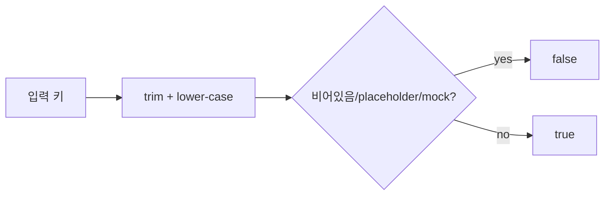
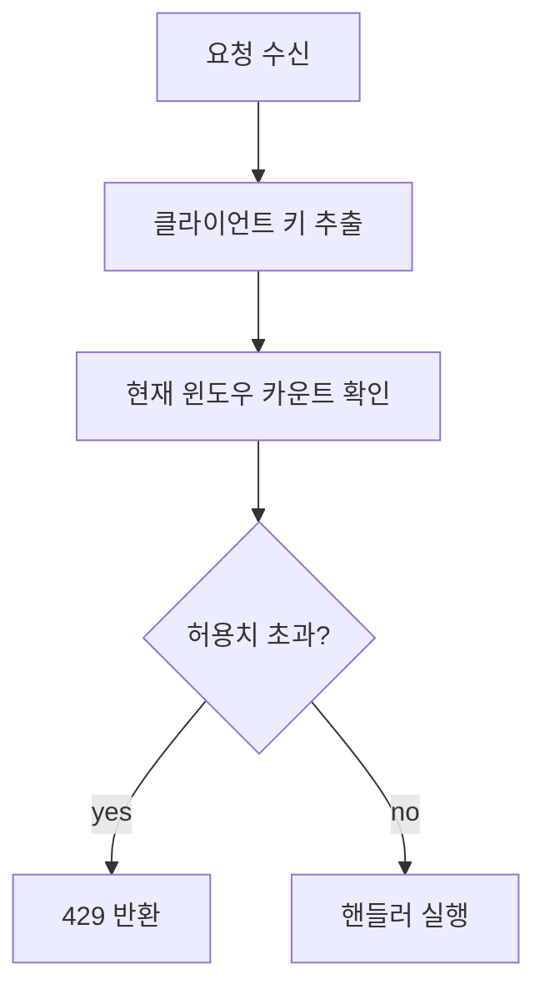
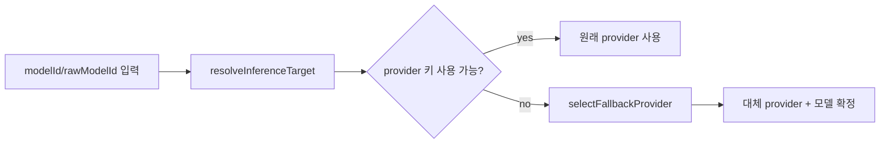
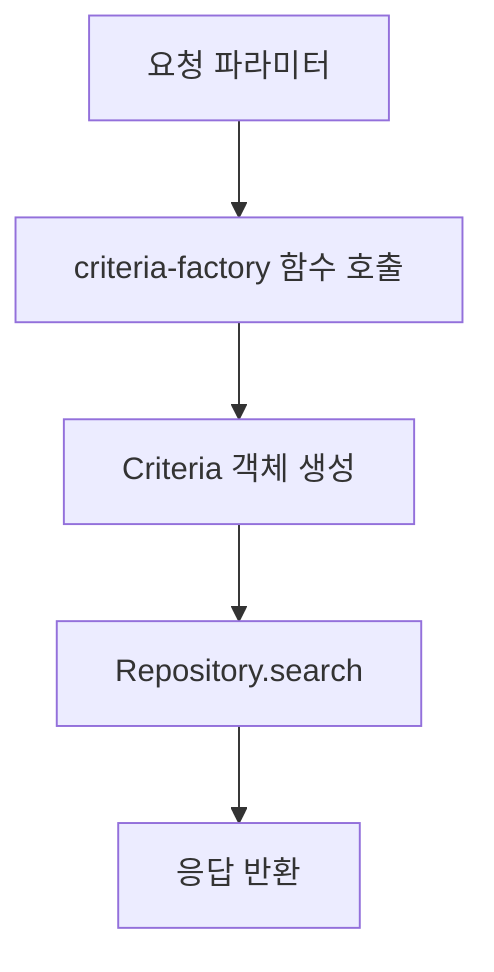
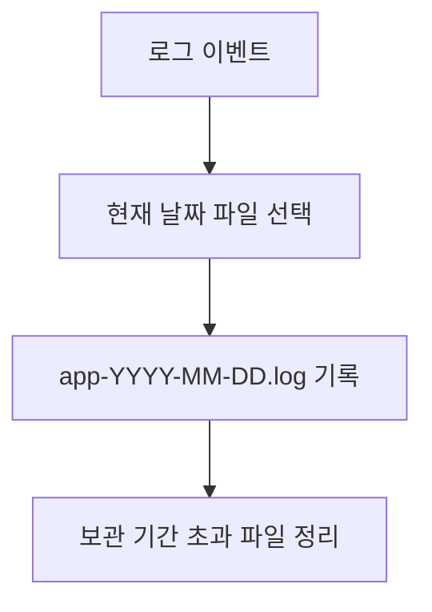
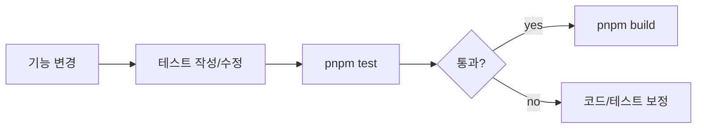

# CMH Chatbot 기능 중심 개발자 가이드

> 대상: 신규/주니어 개발자
> 
> 목적: "어떤 기능이 언제, 왜, 어디서, 어떻게 동작하는지"를 기능 단위로 빠르게 이해할 수 있도록 정리

---

## 1) 보안 카테고리

### 1.1 API Key 유효성 검증

- Trigger(트리거)
  - Provider API 요청 전
  - 모델 목록/폴백 계산 전
- 목적
  - placeholder/mock 키를 실제 키로 오인하지 않도록 차단
- 핵심 프로세스



- 연관 코드
  - `src/shared/security/is-usable-api-key.ts`
  - `src/engine/server/routes/chat-generate.route.ts`
  - `src/renderer/app/service/llm-model.service.ts`
- 연관 UI/모듈
  - 모델 선택 UI(사용 가능한 provider 표시)
- 연관 라이브러리
  - TypeScript 기본 기능

---

### 1.2 Rate Limiting

- Trigger
  - `POST /api/chat`
  - `POST /api/generate`
- 목적
  - 과도한 요청(폭주/오용) 방지
- 핵심 프로세스



- 연관 코드
  - `src/engine/server/routes.ts`
- 연관 UI/모듈
  - 채팅 전송/생성 버튼 (에러 메시지 처리 필요)
- 연관 라이브러리
  - Hono

---

## 2) 추론/Provider 카테고리

### 2.1 Provider 폴백 통합

- Trigger
  - 사용자가 모델 ID를 지정했지만 해당 provider 키가 사용 불가인 경우
- 목적
  - `/api/chat`, `/api/generate`에서 동일한 폴백 정책 적용
- 핵심 프로세스



- 연관 코드
  - `src/engine/server/routes/chat-generate.route.ts`
  - 주요 함수: `resolveInferenceTarget()`, `selectFallbackProvider()`
- 연관 UI/모듈
  - 채팅 모델 선택기
- 연관 라이브러리
  - Vercel AI SDK (`streamText`, `generateText`)

---

## 3) 데이터 접근(DAL) 카테고리

### 3.1 Criteria Factory 패턴

- Trigger
  - provider 목록/모델 목록 조회 시 Criteria 생성 필요
- 목적
  - 라우트별 Criteria 생성 중복 제거
- 핵심 프로세스



- 연관 코드
  - `src/engine/server/routes/criteria-factory.ts`
  - `src/engine/server/routes.ts`
  - `src/engine/server/routes/chat-generate.route.ts`
- 연관 UI/모듈
  - Provider/Model 목록을 소비하는 모든 화면
- 연관 라이브러리
  - 내부 DAL (`Criteria`, `Repository`)

---

## 4) API 문서 카테고리

### 4.1 OpenAPI + Swagger UI

  - 개발자가 엔드포인트 계약을 확인하고 싶을 때
  - API 스펙 가시화/공유 표준화
   `tests/engine/security/is-usable-api-key.test.ts`
   `tests/engine/server/criteria-factory.test.ts`
   `tests/engine/server/webhook-auth.test.ts`
  B --> C[OpenAPI JSON 반환]
  D[/api/docs 요청] --> E[createSwaggerUiHtml]
  E --> F[Swagger UI 렌더]
```

- 연관 코드
  - `src/engine/server/routes/openapi.ts`
  - `src/engine/server/routes.ts`
- 연관 UI/모듈
- 연관 라이브러리
  - Swagger UI CDN (HTML 내 포함)

---

## 5) 운영/관측 카테고리

### 5.1 일 단위 로그 로테이션

- Trigger
  - 서버 로그 출력 시
  - 날짜 변경 시
- 목적
  - 로그 파일 무한 증식 방지, 운영 분석 편의성 향상
- 핵심 프로세스



- 연관 코드
  - `src/engine/core/log-rotating-stream.ts`
  - `src/engine/core/logger.ts`
- 환경변수
  - `LOG_ROTATE_ENABLED`
  - `LOG_DIR`
  - `LOG_RETENTION_DAYS`
- 연관 라이브러리
  - `pino`

---

## 6) 테스트 카테고리

### 6.1 P3 단위 테스트 구성

- Trigger
  - 핵심 유틸/보안 미들웨어 변경 시
- 목적
  - 회귀 버그 방지
- 작성된 테스트
  - `src/renderer/tests/engine/security/is-usable-api-key.test.ts`
  - `src/renderer/tests/engine/server/criteria-factory.test.ts`
  - `src/renderer/tests/engine/server/webhook-auth.test.ts`

- 핵심 프로세스



- 연관 라이브러리
  - `vitest`

---

## 7) 신규 개발자를 위한 빠른 체크리스트

1. 기능 수정 전에 "해당 카테고리"를 먼저 찾는다.
2. 해당 기능의 Trigger/목적/연관 코드를 먼저 읽는다.
3. API나 보안 관련 변경이면 반드시 테스트를 같이 수정한다.
4. `pnpm test` 통과 후 `pnpm build`까지 확인한다.
5. BUG.md 상태를 최신으로 갱신한다.

---

## 8) 권장 학습 순서

1. 보안(`is-usable-api-key`, webhook auth)
2. 라우트 구조(`routes.ts` + `chat-generate.route.ts`)
3. DAL(`criteria-factory.ts`)
4. 운영 로깅(`logger.ts`, `log-rotating-stream.ts`)
5. API 문서(`/api/openapi.json`, `/api/docs`)
