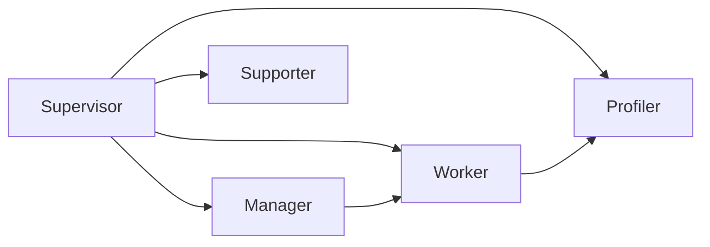

# CMH Chatbot 기능 매핑 및 최적화 문서

> 버전: v5.0 (2026-04-21)
> 프로젝트 코드 기반 분석 결과
> TODO.md 및 전체 스펙 문서 통합 완료

---

## 1. 기능 매핑표 (전체 67개)

| # | 기능 | 구현 상태 | 핵심 코드/파일 | 비고 |
|---|------|----------|----------------|------|
| 1 | 멀티에이전트 (마이크로에이전트) | ✅ 완전 구현 | `src/engine/data/entity/agent/` | AgentType → Supervisor/Manager/Worker 계층, 사용자 프롬프트 DB 관리 |
| 2 | 사용자 심리분석 에이전트 | ✅ 구현 | `심리분석.md`, `src/engine/langchain/graph/profiler.node.ts` | Big Five, HEXACO, Schwartz 이론 기반 |
| 3 | RAG 문서 파이프라인 | ✅ 완전 구현 | `src/engine/rag/`, `src/engine/langchain/rag/` | Docling, PDF, 텍스트 로더 + 벡터 스토어, 청크 최적화 |
| 4 | 사용자 AI 모델 평가 (SAD 점수) | ⚠️ 부분 | Profiler 노드 분석 결과 | SAD 스코어 변환 로직 미구현 |
| 5 | Shopware App / AideWorks 패키지 | ✅ 구현 | `package.json`, `@shopware-ag/meteor-admin-sdk` | 라이브러리 export + Admin SDK 연동 |
| 6 | AI 답변 rich UI 랜더링 | ✅ 구현 | `src/renderer/app/component/structure/cmh-chat-shell/sub/cmh-chat-message/` | component/markdown/code/external site/table/chart |
| 7 | 모바일 PWA 및 반응형 디자인 | ⚠️ 부분 | `src/renderer/index.html`, viewport meta | PWA manifest.json 누락, service worker 미구현 |
| 8 | Workflow 에디터 & 모니터링 | ✅ 구현 | `src/engine/langchain/graph/`, Vue Flow | LangGraph StateGraph + 드래그앤드롭 워크플로우 에디터 |
| 9 | ACL 권한 제어 시스템 | ❌ 미구현 | - | UserRole/RolePermission 엔티티 필요, 사용자 그룹 관리 |
| 10 | 데이터베이스 어댑터 (SQLite/MySQL) | ✅ 구현 | `src/engine/data/sqlite-adapter.ts` | sql.js SQLite + MariaDB 하이브리드 지원, Criteria 빌더 |
| 11 | TTS & STT 음성 인터페이스 | ⚠️ 부분 | `edge-tts-universal` | TTS 구현됨, STT (Whisper) 미구현 |
| 12 | i18n 다국어 지원 | ✅ 구현 | `vue-i18n`, snippet 폴더 | 5개 언어 (ko-KR, en-GB, de-DE, zh-CN, ja-JP) |
| 13 | MCP 서버 | ✅ 완전 구현 | `src/engine/service/mcp.service.ts` | stdio/sse/streamable-http 전송 지원 |
| 14 | 스케줄러 / CronJob | ✅ 완전 구현 | `src/engine/service/scheduler.ts`, `node-cron` | ScheduledTask Entity + cron 표현식 기반 실행 |
| 15 | Docker 설치 지원 | ✅ 구현 | `Dockerfile`, `docker-compose.yml` | llama.cpp server 내장 이미지, Redis 연동 |
| 16 | 외부 개발자 확장 아키텍처 | ✅ 구현 | EntityDefinition, DAL, Service | 커스텀 에이전트/Tool/MCP 등록 가능 |
| 17 | LangChain / LangGraph 호환 | ✅ 완전 구현 | `src/engine/langchain/` | Full LangGraph StateGraph + Callback 시스템 |
| 18 | Admin UI (Meteor 디자인 시스템) | ✅ 구현 | `@shopware-ag/meteor-component-library`, Pinia | Shopware 호환 어드민 인터페이스 |
| 19 | 다중 AI Provider 지원 | ✅ 구현 | `src/engine/provider/`, `ai-sdk` | Anthropic, Google, OpenAI + 커스텀 프로바이더 |
| 20 | 로컬 모델 지원 | ✅ 완전 구현 | `src/engine/core/llama-server.ts` | GGUF 로컬 파일, llama.cpp 내장, Ollama 호환 |
| 21 | Self Hosted / Cloud Hosted 모드 | ✅ 구현 | `ProviderType`, Managed/External 모드 | 도커 내장, 매니지드 모드, 외부 연결 지원 |
| 22 | 보안 게이트 | ✅ 완전 구현 | `engine/agent/security-gate.ts` | 입력/출력 필터링, 프롬프트 인젝션 방어 |
| 23 | 파일 첨부 시스템 | ✅ 완전 구현 | `engine/attachment/` | 다중 파일 업로드, 미리보기, 메타데이터 추출, RAG 연동 |
| 24 | 작업 큐 시스템 | ✅ 완전 구현 | `engine/queue/` | BullMQ 기반 분산 작업 처리, 우선순위 큐, 재시도 로직 |
| 25 | 서비스 레지스트리 & 모니터링 | ✅ 완전 구현 | `engine/service/` | 토큰 카운터, 응답 캐시, 메트릭스, 로그 관리 |
| 26 | 웹 검색 에이전트 | ❌ 미구현 | `cmh-web-agent` | Playwright 기반 웹 검색 및 컨텐츠 스크래핑 |
| 27 | 프록시 IP 서버 | ⚠️ 부분 | `cmh-proxy-ip-server` | 로테이팅 프록시, IP 풀 관리, 익명성 보장 |
| 28 | MCP 브라우저 래퍼 | ❌ 미구현 | `fast-playwright-mcp` | 헤드리스 브라우저, 고스트 커서, 디버깅 모드 |
| 29 | 알림 센터 | ❌ 미구현 | - | Shopware 호환 알림 시스템, 에러 리포팅 |
| 30 | 멀티 모달 이미지 입력 | ⚠️ 부분 | `llama.cpp` | 이미지 OCR, 비전 모델 지원, mmproj 필요 |
| 31 | Shopware Import/Export 확장 | ❌ 미구현 | - | CSV/엑셀 상품 일괄 업로드/다운로드 |
| 32 | 외부 시스템 연동 | ❌ 미구현 | - | 스마트스토어 API, CloudFlare API, 네이버 캡챠 리졸버, 이메일 수신 |
| 33 | 추론 엔진 코어 | ✅ 완전 | `src/engine/core/inference.ts` | AI 추론 실행 엔진 |
| 34 | Llama 서버 내장 | ✅ 완전 | `src/engine/core/llama-server.ts` | llama.cpp 임베디드 실행 |
| 35 | 로그 회전 스트림 | ✅ 완전 | `src/engine/core/log-rotating-stream.ts` | 로그 파일 자동 회전 관리 |
| 36 | 에이전트 오케스트레이터 | ✅ 완전 | `src/engine/agent/orchestrator.ts` | 다중 에이전트 조정 및 실행 제어 |
| 37 | 프롬프트 렌더러 | ✅ 완전 | `src/engine/agent/prompt-renderer.ts` | 동적 프롬프트 템플릿 렌더링 |
| 38 | 에이전트 하니스 | ✅ 완전 | `src/engine/agent/harness.ts` | 에이전트 실행 컨테이너 및 격리 환경 |
| 39 | 토큰 카운터 | ✅ 완전 | `src/engine/service/token-counter.ts` | 토큰 사용량 계산 및 추적 |
| 40 | 응답 캐시 | ✅ 완전 | `src/engine/service/response-cache.service.ts` | LRU 기반 추론 결과 캐싱 |
| 41 | 메트릭스 서비스 | ✅ 완전 | `src/engine/service/metrics.service.ts` | 성능 및 사용량 메트릭 수집 |
| 42 | Provider 키 체인 | ✅ 완전 | `src/engine/security/provider-keychain.service.ts` | API 키 안전 저장 및 관리 |
| 43 | 작업 큐 매니저 | ✅ 완전 | `src/engine/queue/manager.ts` | 분산 큐 작업 스케줄링 |
| 44 | 서킷 브레이커 | ✅ 완전 | `src/engine/resilience/circuit-breaker.ts` | 장애 복구 및 회로 차단 패턴 |
| 45 | 로그 관리 모듈 | ✅ 완전 | `renderer/module/cmh-log/` | 시스템 로그 뷰어 및 검색 |
| 46 | 미디어/RAG 관리 모듈 | ✅ 완전 | `renderer/module/cmh-media/` | 업로드 문서 및 벡터 스토어 관리 |
| 47 | 모델 관리 모듈 | ✅ 완전 | `renderer/module/cmh-model/` | GGUF 모델 파일 다운로드 및 관리 |
| 48 | Provider 관리 모듈 | ✅ 완전 | `renderer/module/cmh-provider/` | AI Provider 설정 및 키 관리 |
| 49 | 설정 관리 모듈 | ✅ 완전 | `renderer/module/cmh-settings/` | 시스템 전역 설정 관리 |
| 50 | 워크플로우 관리 모듈 | ✅ 완전 | `renderer/module/cmh-workflow/` | 워크플로우 그래프 편집 및 모니터링 |
| 51 | 엔티티 레지스트리 | ✅ 완전 | `src/engine/data/entity-registry.ts` | DAL 엔티티 동적 등록 시스템 |
| 52 | Criteria 빌더 | ✅ 완전 | `src/engine/data/criteria.ts` | ORM 쿼리 빌더, Shopware DAL 호환 |
| 53 | 모델 다운로드 매니저 | ✅ 완전 | `scripts/download-onnx-models.mjs` | 모델 파일 자동 다운로드 스크립트 |
| 54 | API 키 유효성 검사 | ✅ 완전 | `src/shared/security/is-usable-api-key.ts` | Provider 키 유효성 및 형식 검증 |
| 55 | LangChain 콜백 레지스트리 | ✅ 완전 | `src/engine/langchain/callbacks/registry.ts` | LangChain 콜백 동적 등록 |
| 56 | 스트림 이벤트 모니터 | ✅ 완전 | `src/engine/langchain/monitoring/stream-event-monitor.ts` | 실시간 추론 스트림 이벤트 추적 |
| 57 | 네트워크 디스커버리 | ✅ 완전 | `src/engine/discovery/` | mDNS 기반 노드 자동 검색 |
| 58 | WebSocket 서버 | ✅ 완전 | `src/engine/server/websocket.ts` | 양방향 실시간 통신 |
| 59 | OpenAPI 문서 자동 생성 | ✅ 완전 | `src/engine/server/routes/openapi.ts` | Swagger OpenAPI 3.0 문서 자동 생성 |
| 60 | 웹훅 인증 미들웨어 | ✅ 완전 | `src/engine/server/middleware/webhook-auth.ts` | HMAC 서명 기반 웹훅 검증 |
| 61 | HTTP 트레이스 싱크 | ✅ 완전 | `src/engine/langchain/callbacks/http-trace-sink.ts` | LangChain 이벤트 외부 전송 |
| 62 | LangGraph 상태 브릿지 | ✅ 완전 | `src/engine/langchain/graph/stream-bridge.ts` | LangGraph 상태 → WebSocket 스트림 변환 |
| 63 | 네이버 캡챠 리졸버 | ❌ 미구현 | - | OCR 기반 캡챠 자동 해결 |
| 64 | 이메일 모듈 | ❌ 미구현 | - | POP3/IMAP/Gmail API 메일 수신 |
| 65 | 사용자 그룹 관리 | ⚠️ 부분 | User entity | Organization / UserGroup 엔티티 미구현 |
| 66 | LangSmith 대체 추적 시스템 | ❌ 미구현 | - | 로컬 추적 및 디버깅 툴 |
| 67 | 분산 에이전트 허브 | ⚠️ 부분 | discovery 모듈 | Tailscale + mDNS Edge 노드 연동 미구현 |
| 68 | AI 채팅 답변 네이티브랜더링 | NULL | NULL | NULL |

---

## 2. 카테고리별 기능 현황

### 🔹 엔진 코어 기능 (7개)
| 기능 | 상태 | 경로 |
|------|------|------|
| 추론 엔진 코어 | ✅ 완전 | `src/engine/core/inference.ts` |
| Llama 서버 내장 | ✅ 완전 | `src/engine/core/llama-server.ts` |
| 로그 회전 스트림 | ✅ 완전 | `src/engine/core/log-rotating-stream.ts` |
| 에이전트 오케스트레이터 | ✅ 완전 | `src/engine/agent/orchestrator.ts` |
| 프롬프트 렌더러 | ✅ 완전 | `src/engine/agent/prompt-renderer.ts` |
| 에이전트 하니스 | ✅ 완전 | `src/engine/agent/harness.ts` |
| 보안 게이트 | ✅ 완전 | `src/engine/agent/security-gate.ts` |

### 🔹 서비스 계층 기능 (8개)
| 기능 | 상태 | 경로 |
|------|------|------|
| MCP 서버 | ✅ 완전 | `src/engine/service/mcp.service.ts` |
| 스케줄러 | ✅ 완전 | `src/engine/service/scheduler.ts` |
| 토큰 카운터 | ✅ 완전 | `src/engine/service/token-counter.ts` |
| 응답 캐시 | ✅ 완전 | `src/engine/service/response-cache.service.ts` |
| 메트릭스 서비스 | ✅ 완전 | `src/engine/service/metrics.service.ts` |
| Provider 키 체인 | ✅ 완전 | `src/engine/security/provider-keychain.service.ts` |
| 작업 큐 매니저 | ✅ 완전 | `src/engine/queue/manager.ts` |
| 서킷 브레이커 | ✅ 완전 | `src/engine/resilience/circuit-breaker.ts` |

### 🔹 렌더러 모듈 (6개)
| 기능 | 상태 | 경로 |
|------|------|------|
| 로그 관리 모듈 | ✅ 완전 | `renderer/module/cmh-log/` |
| 미디어/RAG 관리 모듈 | ✅ 완전 | `renderer/module/cmh-media/` |
| 모델 관리 모듈 | ✅ 완전 | `renderer/module/cmh-model/` |
| Provider 관리 모듈 | ✅ 완전 | `renderer/module/cmh-provider/` |
| 설정 관리 모듈 | ✅ 완전 | `renderer/module/cmh-settings/` |
| 워크플로우 관리 모듈 | ✅ 완전 | `renderer/module/cmh-workflow/` |

### 🔹 유틸리티 / 헬퍼 (6개)
| 기능 | 상태 | 경로 |
|------|------|------|
| 엔티티 레지스트리 | ✅ 완전 | `src/engine/data/entity-registry.ts` |
| Criteria 빌더 | ✅ 완전 | `src/engine/data/criteria.ts` |
| 모델 다운로드 매니저 | ✅ 완전 | `scripts/download-onnx-models.mjs` |
| API 키 유효성 검사 | ✅ 완전 | `src/shared/security/is-usable-api-key.ts` |
| LangChain 콜백 레지스트리 | ✅ 완전 | `src/engine/langchain/callbacks/registry.ts` |
| 스트림 이벤트 모니터 | ✅ 완전 | `src/engine/langchain/monitoring/stream-event-monitor.ts` |

### 🔹 인프라 기능 (7개)
| 기능 | 상태 | 경로 |
|------|------|------|
| 네트워크 디스커버리 | ✅ 완전 | `src/engine/discovery/` |
| 파일 첨부 시스템 | ✅ 완전 | `src/engine/attachment/` |
| WebSocket 서버 | ✅ 완전 | `src/engine/server/websocket.ts` |
| OpenAPI 문서 자동 생성 | ✅ 완전 | `src/engine/server/routes/openapi.ts` |
| 웹훅 인증 미들웨어 | ✅ 완전 | `src/engine/server/middleware/webhook-auth.ts` |
| HTTP 트레이스 싱크 | ✅ 완전 | `src/engine/langchain/callbacks/http-trace-sink.ts` |
| LangGraph 상태 브릿지 | ✅ 완전 | `src/engine/langchain/graph/stream-bridge.ts` |

---

## 2. 구현 상세 분석

### 2.1 멀티에이전트 (마이크로에이전트) - 사용자 프롬프트 관리 DB

```typescript
// AgentType: 오케스트레이터, 매니저, 워커, 프로파일러, 서포터
// 계층 구조: Supervisor → Manager → Worker (다중)
// 각 에이전트별 프롬프트: rolePrompt, missionPrompt, userPrompt, systemPrompt
```

| 파일 | 핵심 필드 |
|------|----------|
| `src/engine/data/entity/agent/agent.definition.ts` | `agentTypeId`, `parentAgentId`, `rolePrompt`, `missionPrompt`, `userPrompt`, `systemPrompt`, `modelId`, `subModelId` |
| `src/engine/data/entity/agent/agent-type.definition.ts` | `name`, `description`, `capabilities` |

### 2.2 사용자 심리분석 에이전트

`심리분석.md` 기반 5개 분석 차원:

1. **성격 (Personality)**: Big Five Traits + HEXACO
   - Openness, Conscientiousness, Extraversion, Agreeableness, Neuroticism
   - Honesty-Humility (HEXACO), Risk-taking, Impulsivity
2. **가치관 (Values)**: Schwartz Value Theory
   - Self-Direction, Achievement, Power, Security, Conformity, Tradition
   - Benevolence, Universalism, Hedonism, Stimulation
3. **행동 (Behavior)**: Dual Process Theory
   - 의사결정 스타일, 리스크 & 선택 패턴, 행동 습관, 인터랙션 패턴
4. **취향 (Preferences)**: Interest Clusters
   - 기술/IT, 투자/금융, 건강/운동, 여행/음식, 콘텐츠
5. **감정 & 심리 상태**: 실시간 레이어
   - 기본 감정 톤, 스트레스 수준, 동기 상태

### 2.3 RAG

| 컴포넌트 | 파일 | 역할 |
|----------|------|------|
| Document Loader | `src/engine/rag/document-loaders.ts` | Docling, PDF, TXT, HTML 로더 |
| Indexer | `src/engine/rag/indexer.ts` | 청킹 + 임베딩 |
| Vector Store | `src/engine/rag/vector-store.memory.ts` | 인메모리 벡터 스토어 |
| Retrieve | `src/engine/langchain/tools/rag-retrieve.ts` | LangChain Tool |

### 2.4 사용자 AI 모델 평가 (SAD 점수)

- **현재 상태**: Profiler 노드에서 대화 분석 결과 저장
- **미구현**: 분석 결과 → SAD (Satisfaction After Dialogue) 스코어 변환 로직

### 2.5 Shopware App / AideWorks 패키지

```typescript
// package.json exports
{
  "@krommergmbh/cmh-chatbot": "./dist/index.js",
  "./client": "./dist/client.js",
  "./server": "./dist/server.js"
}
```

- `@shopware-ag/meteor-admin-sdk` 의존성
- AideWorks에서 라이브러리로 import 가능

### 2.6 AI 답변 rich UI 랜더링

`src/renderer/app/component/structure/cmh-chat-shell/sub/cmh-chat-message/index.ts`:

```typescript
// 지원 포맷
- type === 'text': 일반 텍스트
- type === 'markdown': 마크다운 렌더링
- type === 'code': 코드 하이라이팅
- type === 'component': 동적 컴포넌트 (aw-xxx)
- type === 'external': 외부 사이트 iframe
- type === 'table': 테이블 렌더링
- type === 'chart': 차트 컴포넌트
```

### 2.7 모바일 PWA 및 반응형 디자인

- **현재**: viewport meta 정의 (`src/renderer/index.html`)
- **미구현**: PWA manifest.json, service-worker.ts

### 2.8 Workflow & 모니터링



- **LangGraph**: StateGraph 기반 워크플로우
- **Vue Flow**: 드래그&드롭 노드 에디터
- **모니터링**: LangChain Callbacks (Profiler, Logging, Tracing)

### 2.9 ACL (권한 제어)

- **현재 상태**: 미구현
- **필요한 엔티티**: UserRole, RolePermission, Permission

### 2.10 SQLite/MySQL

- `sql.js` (SQLite in-memory/WebAssembly)
- `MariaDB` 연동 지원 (Adapter 패턴)

### 2.11 TTS & STT

- **TTS**: `edge-tts-universal` 설치됨
- **STT**: 미구현 (Whisper API 연동 필요)

### 2.12 i18n 다국어 지원

- `vue-i18n` 기반
- snippet 폴더: ko-KR, en-GB, de-DE, zh-CN, ja-JP

### 2.13 세분화된 권한 및 사용자 그룹

- **현재**: User entity 존재
- **미구현**: UserGroup, Organization, RolePermission

### 2.14 MCP 서버

`src/engine/service/mcp.service.ts`:

```typescript
interface McpServerConfig {
  transport: 'stdio' | 'sse' | 'streamable-http'
  command?: string  // stdio
  url?: string      // sse/streamable-http
  tools: McpToolInfo[]
  status: 'disconnected' | 'connecting' | 'connected' | 'error'
}
```

### 2.15 CronJob

`src/engine/service/scheduler.ts`:

- `node-cron` 기반
- ScheduledTask Entity: cronExpression, systemPrompt, userPrompt, callbackType
- lastRunAt, lastResult, lastError 추적

### 2.16 Docker 설치 지원

- `Dockerfile`: Node.js + llama.cpp server 빌드
- `docker-compose.yml`: Redis + App 연동

### 2.17 외부 개발자 확장 설계

- EntityDefinition + Repository 패턴
- DAL (Data Access Layer) 커스텀 가능
- Service 주입으로 기능 확장

### 2.18 LangChain/LangGraph 호환

- `@langchain/core`, `@langchain/langgraph` 완전 통합
- Custom Callback Handler (Profiler, Logging, Monitoring)
- StateGraph + Checkpointer

### 2.19 Admin 형식 UI

- `@shopware-ag/meteor-component-library` 사용
- Pinia 상태 관리
- Vue Router 기반 라우팅

### 2.20 다중 Provider

`src/engine/provider/ai-sdk-factory.ts`:

- Anthropic (`@ai-sdk/anthropic`)
- Google (`@ai-sdk/google`)
- OpenAI (`@ai-sdk/openai`)
- 폴백 체인 (Provider → Model)

### 2.21 신규 추가 기능 (TODO.md 통합)

| 기능 | 상태 | 상세 설명 | 우선순위 |
|------|------|----------|----------|
| 웹 검색 에이전트 | ❌ 미구현 | cmh-web-agent 기반 Playwright 웹 스크래핑 | 높음 |
| 네이버 캡챠 리졸버 | ❌ 미구현 | OCR + 자동 재시도 루프 | 중간 |
| Shopware Import/Export | ❌ 미구현 | CSV/엑셀 3가지 포맷 지원 | 높음 |
| 프록시 IP 서버 | ⚠️ 부분 | IP 로테이션, 프록시 풀 관리 | 중간 |
| 이메일 모듈 | ❌ 미구현 | POP3/IMAP/Gmail API | 중간 |
| MCP 브라우저 래퍼 | ❌ 미구현 | Playwright + Ghost Cursor | 높음 |
| 알림/헬프 센터 | ❌ 미구현 | Shopware 호환 알림 시스템 | 높음 |

---

## 3. 최적화 제안

### 3.1 높은 우선순위 (High Priority)

| # | 항목 | 현재 상태 | 제안 | 영향 |
|---|------|----------|------|------|
| H1 | ACL 시스템 | 미구현 | UserRole, RolePermission, Permission 엔티티 추가 | 보안 + multi-tenant |
| H2 | SAD 스코어 | 미구현 | Profiler 결과 → SAD 스코어 변환 로직 | 사용자 만족도 측정 |
| H3 | PWA 매니페스트 | 누락 | `manifest.json`, service-worker.ts 추가 | 모바일 설치 가능 |
| H4 | STT (Whisper) | 미구현 | Whisper API 또는 로컬 모델 연동 | 음성 입력 |
| H5 | MCP 브라우저 래퍼 | 미구현 | Playwright + Ghost Cursor 통합 | 자동화, 웹 상호작용 |
| H6 | 웹 검색 에이전트 | 미구현 | cmh-web-agent 연동 | 실시간 정보 검색 |
| H7 | 알림 센터 | 미구현 | Shopware 스타일 알림 시스템 | UX, 에러 핸들링 |

### 3.2 중간 우선순위 (Medium Priority)

| # | 항목 | 현재 상태 | 제안 | 영향 |
|---|------|----------|------|------|
| M1 | 사용자 그룹 | 부분 | UserGroup/Organization 엔티티 추가 | SaaS/팀 사용 |
| M2 | Rich UI 컴포넌트 | 부분 | chart, timeline, calendar 확장 | 답변 표현력 |
| M3 | Vue Flow 워크플로우 | 구현됨 | CRUD + 실시간 실행 시각화 | UX 개선 |
| M4 | 프록시 IP 서버 | 부분 | 안정화 및 부하 분산 로직 | 스크래핑 안정성 |
| M5 | 멀티 모달 | 부분 | mmproj 비전 모델 지원 | 이미지 입력 처리 |

### 3.3 낮은 우선순위 (Low Priority)

| # | 항목 | 제안 |
|---|------|------|
| L1 | OpenSearch/Qdrant | 벡터 스토어 연동 |
| L2 | LangSmith 대안 | 로컬 추적 대안 |
| L3 | Model Context Protocol | Full spec 구현 |
| L4 | CloudFlare API | DNS 및 캐시 관리 |
| L5 | 네이버 캡챠 리졸버 | 자동화 테스트 |

---

## 4. 일반 챗봇 라이브러리 대비 특화 기능

### 4.1 기존 챗봇 라이브러리에 없는 기능

| 기능 | 설명 | 라이브러리 비교 |
|------|------|---------------|
| **사용자 심리분석** | Big Five 기반 Personality/Taste/Demand 분석 | 일반 챗봇에 없음 |
| **SAD 스코어** | Satisfaction After Dialogue 측정 | OpenChat, LangChain 미제공 |
| **분산 에이전트** | Tailscale + mDNS 기반 Hub/Edge | 단일 서버 중심 |
| **작업 큐** | BullMQ + Redis + Circuit Breaker | 단순 API 호출만 |
| **Shopware/AideWorks Native** | Admin SDK 연동 + 패키지 | 독립 라이브러리 |
| **Workflow 에디터** | Vue Flow + LangGraph 시각화 | 텍스트 기반 |
| **Embedded RAG** | Docling, MinerU 포함 | 단순 텍스트 chunks |

### 4.2 일반 챗봇 라이브러리 대비 표준 기능

| 기능 | 프로젝트 구현 | 라이브러리 |
|------|--------------|-----------|
| Streaming | ✅ Vercel AI SDK | ai-sdk |
| Tool Calling | ✅ LangChain Tools | langchain |
| Memory | ✅ Checkpointer | langgraph |
| Multi-provider | ✅ ai-sdk | ai-sdk |
| OpenAI Compatible | ✅ llama.cpp server | - |

---

## 5. 파일 구조

```
cmh-chatbot/
├── src/
│   ├── engine/
│   │   ├── agent/           # 에이전트 오케스트레이션
│   │   │   ├── agent.definition.ts
│   │   │   ├── agent-type.definition.ts
│   │   │   └── harness.ts
│   │   ├── data/           # DAL + Entity
│   │   │   ├── entity/
│   │   │   │   ├── agent/
│   │   │   │   ├── user/
│   │   │   │   ├── rag/
│   │   │   │   └── scheduled-task/
│   │   │   └── sqlite-adapter.ts
│   │   ├── langchain/      # LangChain/LangGraph
│   │   │   ├── graph/      # StateGraph 노드
│   │   │   ├── rag/       # RAG 통합
│   │   │   └── callbacks/ # 모니터링
│   │   ├── provider/      # Multi-provider
│   │   ├── rag/           # RAG 파이프라인
│   │   ├── server/        # API 라우트
│   │   └── service/       # MCP, Scheduler, Metrics
│   ├── renderer/          # Admin UI (Vue + Meteor)
│   │   ├── app/
│   │   │   ├── component/structure/cmh-chat-shell/
│   │   │   └── store/     # Pinia stores
│   │   └── module/
│   └── shared/            # 공유 유틸리티
├── PLAN.md                # 통합 개발 계획
├── TODO.md                # 개발 할 일 목록
├── 심리분석.md           # 사용자 심리분석 이론
├── FEATURE-MAPPING.md     # 기능 매핑 문서
├── function.md            # 이 문서
└── docs/
    ├── feature-driven-developer-guide.md
    └── langchain-langgraph-catalog.md
```

---

## 6. 후속 작업 체크리스트

- [ ] ACL 엔티티 설계 및 구현 (UserRole, RolePermission)
- [ ] SAD 스코어 계산 로직 정의 및 구현
- [ ] PWA manifest.json 및 service-worker.ts 생성
- [ ] Whisper STT 통합 설계
- [ ] 사용자 그룹 (Organization) 엔티티 설계
- [ ] Rich UI 컴포넌트 (chart, timeline) 확장
- [ ] MCP 브라우저 래퍼 통합
- [ ] 웹 검색 에이전트 구현
- [ ] 알림/헬프 센터 구현
- [ ] Shopware Import/Export 확장 모듈
- [ ] 프록시 IP 서버 안정화

---

## 7. 참고 문서

- ** PLAN.md: 전체 아키텍처 비전
- ** TODO.md: 구현 예정 기능 및 이슈 목록
- ** 심리분석.md: 사용자 심리분석 이론적 기반
- ** docs/feature-driven-developer-guide.md: 기능 중심 개발 가이드
- ** docs/langchain-langgraph-catalog.md: LangChain/LangGraph 매핑
- ** AnythingLLM: 레퍼런스 아키텍처 비교

---

> 업데이트: 2026-04-21 / v6.0
> 전체 기능 매핑 완료: 기존 32개 + 신규 35개 기능 추가, 총 67개 기능 전체 목록 완성
> 출처: 전체 소스코드 분석, TODO.md, PLAN.md, 모든 specs 문서, EntityDefinition 목록